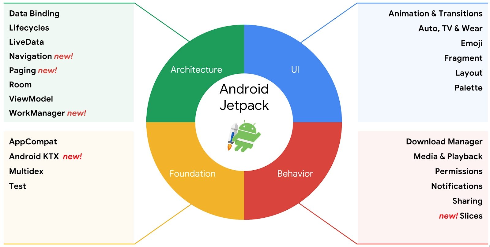

## :pushpin:自我介绍

01年程序员🖥️，23年毕业生🤠，梦想成为Android大佬博主，在热烈的与生活交手🍀

## :sparkles:本博客的导引

### :fountain_pen:安卓基础入门知识

1. 嵌入式安卓学习入门：[点击跳转到相关博客](./study-notes/android/guide/嵌入式安卓学习入门.md)  
2. ADB命令：[点击跳转到相关博客](./study-notes/android/guide/adb-command.md)  
3. Git使用导览：[点击跳转到相关博客](./study-notes/android/guide/git-use-note.md)  
4. Git命令清单：[点击跳转到相关博客](./study-notes/android/guide/git-note.md)  
5. 编程规范：[点击跳转到相关博客](./study-notes/android/guide/style-guide.md)  
6. 第一行代码Android笔记：[点击跳转到相关博客](./study-notes/android/guide/第一行代码Android笔记.md)

### :fountain_pen:安卓系统层知识

系统知识：  
1. (一)Android系统启动流程：[点击跳转到相关博客](./study-notes/android/theory/Android系统启动流程.md)  
2. (二)Android的源码与编译：[点击跳转到相关博客](./study-notes/android/theory/源码与编译.md)  
3. (三)编译系统：[点击跳转到相关博客](./study-notes/android/theory/编译系统.md)  
4. (四)进程间通信(一)：[点击跳转到相关博客](./study-notes/android/theory/进程间通信(一).md)  
5. (五)进程间通信(二)：[点击跳转到相关博客](./study-notes/android/theory/进程间通信(二).md)  
6. (六)Android的进程和线程：[点击跳转到相关博客](./study-notes/android/theory/Android进程和线程.md)  
7. (专)线程通信机制——Handler：[点击跳转到相关博客](./study-notes/android/theory/线程通信机制Handler.md)  
8. (专)线程通信机制——AsyncTask(过时)：[点击跳转到相关博客](./study-notes/android/theory/线程通信机制AsyncTask.md)  
9. (专)Android权限机制：[点击跳转到相关博客](./study-notes/android/theory/Android权限机制.md)  
10. (专)OTA升级机制：[点击跳转到相关博客](./study-notes/android/theory/OTA升级机制.md)

系统功能修改：  
1. AmlogicS905x方案合集：[点击跳转到相关博客](./study-notes/android/experience/Amlogics905x方案合集.md)  
2. 休眠和屏保：[点击跳转到相关博客](./study-notes/android/function/sleep-screensaver.md)  
3. WIFI随机MAC地址：[点击跳转到相关博客](./study-notes/android/function/WIFI随机MAC地址.md)  
4. 安卓的签名和权限：[点击跳转到相关博客](./study-notes/android/function/安卓的签名和权限.md)  
5. 对apk进行签名：[点击跳转到相关博客](./study-notes/android/function/AOSPapk签名.md)  
6. AOSP Settings 展示所有应用：[点击跳转到相关博客](./study-notes/android/function/AOSPSettings展示所有应用.md)  
7. Amlogic方案红外遥控器配置：[点击跳转到相关博客](./study-notes/android/function/Amlogic方案红外遥控器配置.md)  
8. 添加屏幕旋转按钮：[点击跳转到相关博客](./study-notes/android/function/Settings添加屏幕旋转按钮.md)  
9. 修改默认音量和最大音量：[点击跳转到相关博客](./study-notes/android/function/修改默认音量和最大音量.md)  
10. 去除升级时间戳校验：[点击跳转到相关博客](./study-notes/android/function/去除升级时间戳校验.md)  
11. 开机启动日志捕捉服务：[点击跳转到相关博客](./study-notes/android/function/开机启动日志捕捉服务.md)  
12. 缺少开机引导导致HOME键失效：[点击跳转到相关博客](./study-notes/android/function/Provision解决Home键失效.md)  
13. 预定义屏幕分辨率与屏幕像素密度：[点击跳转到相关博客](./study-notes/android/function/分辨率与density.md)  
14. 解决无限循环的 udc-core 报错问题：[点击跳转到相关博客](./study-notes/android/function/udc-core报错.md)  
15. 解决 Android 应用日志中 JDWP 报错问题：[点击跳转到相关博客](./study-notes/android/function/jdwp报错.md)

### :fountain_pen:安卓应用开发知识

基础组件：
1. Activity：[点击跳转到相关博客](./study-notes/android/UI/base/Activity.md)  
2. Service：[点击跳转到相关博客](./study-notes/android/UI/base/Service.md)  
3. Broadcast：[点击跳转到相关博客](./study-notes/android/UI/base/Broadcast.md)  
4. ContentProvider：[点击跳转到相关博客](./study-notes/android/UI/base/ContentProvider.md)
5. Context：[点击跳转到相关博客](./study-notes/android/UI/base/Context.md)  
6. Intent：[点击跳转到相关博客](./study-notes/android/UI/base/Intent.md)  
7. Fragment：[点击跳转到相关博客](./study-notes/android/UI/base/Fragment.md)  
8. Bundle：[点击跳转到相关博客](./study-notes/android/UI/base/Bundle.md)

Jetpack组件:

Architecture 架构：
* Data Binding → 数据绑定，可使用 声明式 将布局中的界面组件绑定到应用中的数据源；[点击跳转到相关博客](./study-notes/jetpack/DataBinding.md)
* Lifecycles → 生命周期感知，可感知和响应Activity和Fragment的生命周期状态的变化；[点击跳转到相关博客](./study-notes/jetpack/Lifecycle.md)
* LiveData → 可观察的数据持有者类，与常规Observable不同，它是具有生命周期感知的；[点击跳转到相关博客](./study-notes/jetpack/LiveData.md)
* RecyclerView → 用于显示列表形式 (list) 或者网格形式 (grid) 的数据，比如文本或者照片；[点击跳转到相关博客](./study-notes/jetpack/RecyclerView.md)
* ViewPager → 可以可滑动的格式显示视图或 Fragment；[点击跳转到相关博客](./study-notes/jetpack/ViewPager.md)
* Navigation → 应用内导航，Fragment的管理框架，或者说路由；
* Paging → 列表分页，可以轻松实现分页预加载以达到无限滑动的效果；
* Room → 轻量级ORM数据库，本质上是一个SQLite抽象层，注解 + 编译时自动生成功能类；
* ViewModel → 数据存储组件，具备生命周期感知能力；[点击跳转到相关博客](./study-notes/jetpack/ViewModel.md)
* WorkManager → 托管延时任务，即使APP被杀、或设备重启，只要TaskRecord还存在最近访问列表中，都会执行；

Foundation 基础：
* AppCompat → 帮助较低版本的Android系统进行兼容；
* Android KTX → 基于Kotlin特性为Android、Jetpack提供一些简易易用的扩展；
* Multidex → 为具有多个Dex文件应用提供支持；
* Test → 用于单元和运行时界面测试的 Android 测试框架；
* Benchmark(性能检测)、Security(安全)等；

UI 界面：
* Animation & Transition → 内置动画及自定义动画效果；
* Emoji → 即便用户没有更新Android系统也可以获取最新的表情符号；
* Auto(车)、TV、WearOS；
* Fragment → 组件化界面的基本单位；
* Layout → 用XML中声明UI元素或者在代码中实例化UI元素；
* Paletee → 从调色板中提取出有用的信息；

Behavior 行为：
* Download Manager → 处理长时间运行的HTTP下载、超时重连的系统服务；
* Media & Playback → 用于媒体播放和路由(包括 Google Cast)的向后兼容 API；
* Permissions → 用于检查和请求应用权限的兼容性API；
* Notifications → 提供向后兼容的通知API，支持Wear和Auto；
* Sharing → 提供适合应用操作栏的共享操作；
* Slices → 一种UI模板，创建可在营养外部显示应用数据的灵活界面元素；

一些 UI 实现
1. 常见界面布局Layout：[点击跳转到相关博客](./study-notes/android/UI/常见界面布局Layout.md)

### :fountain_pen:其他学习笔记
1. Java笔记：[点击跳转到相关博客](./study-notes/java/summary)
2. Kotlin基础语法：[点击跳转到相关博客](./study-notes/kotlin/kotlin笔记.md)
3. Kotlin协程：[点击跳转到相关博客](./study-notes/kotlin/kotlin协程.md)
4. Flutter笔记：[点击跳转到相关博客](./study-notes/flutter/Flutter笔记.md)
5. shell脚本：[点击跳转到相关博客](./study-notes/other/shell脚本.md)
6. 软考知识点：[点击跳转到相关博客](./study-notes/other/软考知识点.md)

### :fountain_pen:项目汇总
1. TS码流解析工具：[点击跳转到相关博客](./project-summary/TS码流解析工具.md)
2. GLauncher：[点击跳转到相关博客](./project-summary/glauncher.md)
3. Compose TV：[点击跳转到相关博客](./project-summary/ComposeTV.md)
4. OTA软件：[点击跳转到相关博客](./project-summary/OTA软件.md)
5. Launcher3：[点击跳转到相关博客](./project-summary/Launcher3.md)

## :rocket:安卓工程师成长路线

### :fountain_pen:android初级程序员

**总结**：能干活，有学习能力，能跟着团队成员做项目；

**技能**：
1. 熟悉android的四大组件、生命周期，常用界面布局
2. 常用第三方框架的使用
3. 熟悉android的常用API、网络框架
5. 掌握数据库相关知识点
6. 了解android项目目录的组织架构

### :fountain_pen:android中级程序员

**总结**：能够分析问题，能够解决问题；

**技能**：
1. 了解android的签名机制（实现原理，具体操做）
2. 打包机制（多渠道打包，打包流程等等）
3. 了解apk安装文件压缩（压缩图片，代码压缩，.so文件压缩等等）
4. 了解事件分发，View绘制流程，webview相关知识点（与Native的交互，性能优化等）
5. 熟悉数据库的使用（基本API，第三方ORM框架，ORM框架的实现原理等等）
6. 有java反射原理与简单实践经验，屏幕适配，AIDL与messager的简单实用
7. 自定义组件经验（自定义View与自定义ViewGroup）
8. 动画（补间动画，帧动画，属性动画）
9. 通知栏消息，版本新特性

**要求**：开始阅读android方面的而源码，不但能看懂别人的代码还需要能够修改别人源码，对android的体系结构，组成方式，常见开源社区，技术要点能够了然于胸。

### :fountain_pen:android高级程序员

**总结**：能够解决问题，能够发现问题

**技能**：
手动编写框架，设计模式，代码规范，项目进度，时间估算，启动流程，性能优化，OOM，内存溢出与泄露，JNI，脚本开发，activity启动流程，android中的IPC机制（Binder原理），对iOS等其他移动开发现学现用等等；

**要求**：能够造轮子，比如写一个网络框架，事件总线控件，特效View等，重点是能够为产品造轮子。

## :pencil:座右铭
只要不失去你的崇高，整个世界都会向你敞开🌟

## :phone:联系我
**邮箱**：2212294193@qq.com