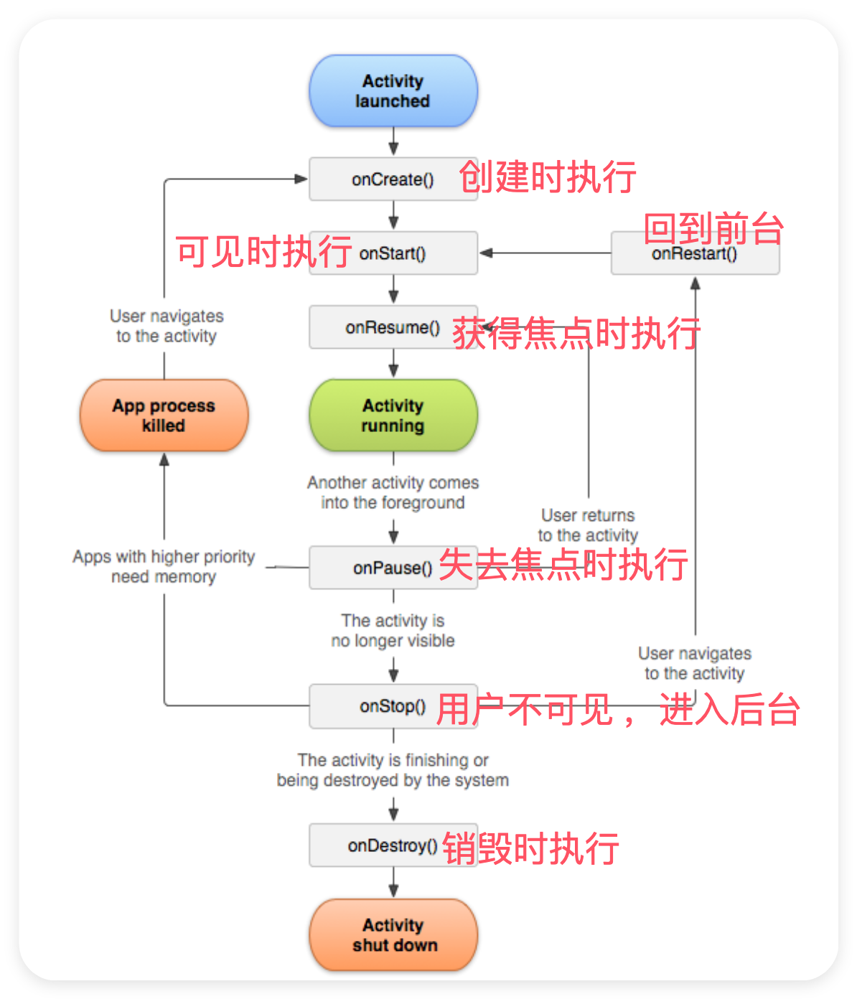
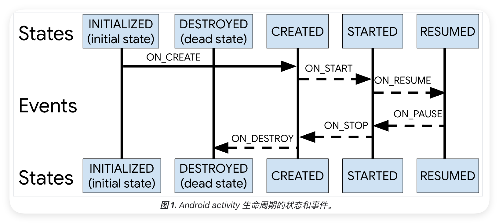

## Activity基础概念与核心机制
::: tip 核心要点
Activity 作为 Android 四大组件之一，承担着用户界面交互的核心职责
:::

在android中，Activity相当于一个页面，可以在 Activity中添加 Button、CheckBox 等控件，一个android程序有多个Activity组成。
 
* 一个 Activity 通常就是一个单独的屏幕(窗口)
* Activity 之间通过 Intent 进行通信。
* Android 应用中每一个 Activity 都必须要在 `AndroidManifest.xml` 配置文件中声明，否则系统将不识别也不执行该Activity。在 android stdio会自动生成。

### Activity 的创建与继承

```kotlin
class TestActivity : AppCompatActivity() {
    override fun onCreate(savedInstanceState: Bundle?) {
        super.onCreate(savedInstanceState)
        setContentView(R.layout.activity_test)
    }
}
```
以上是一个最简单的Activity，该Activity的名字叫做TestActivity，继承自AppCompatActivity 这个基类，并且设置了自己的视图为`R.layout.activity_test`。

* 这里的`AppCompatActivity`是最常用的父类，继承自 Activity，其包名为`androidx.appcompat.app.AppCompatActivity`。提供了对旧版本 Android 的兼容性支持，支持 ActionBar 和 Material Design 的功能。
* `AppCompatActivity`的详细继承路径为
    ```
    AppCompatActivity -> FragmentActivity -> ComponentActivity -> Activity
    ```
    由此可见AppCompatActivity 实际上做了多层的封装，对于初学者来说只需要知道我们的 Activity 最常继承自AppCompatActivity 即可。
* 其余可以继承的 Activity 还有：Activity、FragmentActivity、ListActivity(deprecated)、PreferenceActivity、(deprecated)

### 在 AndroidManifest.xml 中声明 Activity

一、 **Activity 的声明**
一个 Activity 的最简单的声明如下：
```xml
<activity
    android:name=".component.demo.TestActivity"
    android:exported="false" />
```
其中 name指定 Activity 的完整类名，exported指定 Activity 是否可以被其他应用启动。

稍微复杂一些的Activity 的声明如下：
```xml
<activity
    android:name=".component.demo.TestActivity"
    android:label="@string/test_activity_label"
    android:icon="@drawable/ic_test_activity"
    android:theme="@style/Theme.AppCompat.Light.DarkActionBar"
    android:exported="false"
    android:enabled="true"
    android:allowTaskReparenting="true"
    android:alwaysRetainTaskState="true"
    android:autoRemoveFromRecents="false"
    android:clearTaskOnLaunch="false"
    android:configChanges="orientation|keyboardHidden|screenSize|mcc|mnc|locale|touchscreen|keyboard|navigation|fontScale|uiMode|screenLayout|density"
    android:excludeFromRecents="false"
    android:finishOnTaskLaunch="false"
    android:hardwareAccelerated="true"
    android:iconifiedByDefault="false"
    android:launchMode="singleTask"
    android:lockTaskMode="never"
    android:multiWindowCategory="default"
    android:noHistory="false"
    android:parentActivityName=".MainActivity"
    android:permission="com.example.permission.ACCESS_TEST_ACTIVITY"
    android:process=":test_process"
    android:resizeableActivity="true"
    android:screenOrientation="portrait"
    android:stateNotNeeded="false"
    android:supportsPictureInPicture="true"
    android:taskAffinity="com.example.test.affinity"
    android:uiOptions="splitActionBarWhenNarrow"
    android:windowSoftInputMode="adjustResize|stateVisible">
    
    <!-- 意图过滤器 -->
    <intent-filter>
        <action android:name="android.intent.action.VIEW" />
        <category android:name="android.intent.category.DEFAULT" />
        <category android:name="android.intent.category.BROWSABLE" />
        <data android:scheme="http" android:host="example.com" />
    </intent-filter>
    
    <!-- 元数据 -->
    <meta-data
        android:name="com.example.metadata.TEST_KEY"
        android:value="test_value" />
</activity>
```

二、 **AndroidManifest.xml属性详解**

完整的介绍可以查看：[官网对`<activity>`的介绍](https://developer.android.com/guide/topics/manifest/activity-element?hl=zh-cn#reparent)。下面是可以被设置的各种属性：
```
1. 基本属性
android:name：指定 Activity 的完整类名（如 .component.demo.TestActivity）。
android:label：指定 Activity 的标题（显示在任务管理器或启动器中）。
android:icon：指定 Activity 的图标（显示在任务管理器或启动器中）。
android:banner：指定 Activity 的横幅资源。
android:theme：指定 Activity 的主题（如 @style/Theme.AppCompat.Light.DarkActionBar）。
2. 行为控制
android:exported：是否允许其他应用通过 Intent 启动此 Activity（true 或 false）。
android:enabled：是否允许系统实例化此 Activity（true 或 false）。
android:launchMode：指定启动模式（standard、singleTop、singleTask、singleInstance、singleInstancePerTask）。
android:taskAffinity：指定 Activity 属于哪个任务栈。
android:allowTaskReparenting：是否允许 Activity 在任务间重新关联（true 或 false）。
android:alwaysRetainTaskState：是否始终保留任务状态（true 或 false）。
android:clearTaskOnLaunch：是否在启动任务时清除任务栈中的其他 Activity（true 或 false）。
android:excludeFromRecents：是否将 Activity 从最近任务列表中排除（true 或 false）。
android:finishOnTaskLaunch：是否在任务启动时自动销毁 Activity（true 或 false）。
android:noHistory：是否将 Activity 从任务栈中移除（true 或 false）。
android:persistableMode：指定 Activity 是否可以持久化（persistRootOnly、persistAcrossReboots、persistNever）。
3. 配置变化
android:configChanges：指定 Activity 在配置变化（如屏幕旋转）时的行为（如 orientation、keyboardHidden 等）。
android:screenOrientation：强制 Activity 的屏幕方向（如 portrait、landscape）。
android:resizeableActivity：是否支持多窗口模式（true 或 false）。
android:configChanges：指定 Activity 在配置变化时的行为（如 colorMode、density、fontScale 等）。
4. 窗口和主题 
android:theme：指定 Activity 的主题（如 @style/Theme.AppCompat.Light.DarkActionBar）。
android:windowSoftInputMode：指定软键盘的行为（如 adjustResize、stateVisible）。
android:uiOptions：指定 UI 选项（如 splitActionBarWhenNarrow）。
android:immersive：是否启用沉浸式模式（true 或 false）。
5. 权限和安全
android:permission：指定启动 Activity 所需的权限。
android:lockTaskMode：指定是否锁定任务模式（normal、never、if_whitelisted、always）。
android:directBootAware：是否支持直接启动（true 或 false）。
android:requireContentUriPermissionFromCaller：指定调用者需要的 URI 权限（none、read、readAndWrite 等）。
6. 性能优化
android:hardwareAccelerated：是否启用硬件加速（true 或 false）。
android:supportsPictureInPicture：是否支持画中画模式（true 或 false）。
android:autoRemoveFromRecents：是否自动从最近任务列表中移除（true 或 false）。
android:stateNotNeeded：是否不需要保存状态（true 或 false）。
7. 其他
android:documentLaunchMode：指定文档启动模式（intoExisting、always、none、never）。
android:parentActivityName：指定父 Activity 的名称（用于返回导航）。
android:process：指定 Activity 运行的进程名。
android:showForAllUsers：是否对所有用户显示（true 或 false）。
android:colorMode：指定颜色模式（hdr、wideColorGamut）。
android:canDisplayOnRemoteDevices：是否可以在远程设备上显示（true 或 false）。
android:enabledOnBackInvokedCallback：是否启用回调（true 或 false）。
android:relinquishTaskIdentity：是否放弃任务身份（true 或 false）。
android:maxRecents：指定最近任务列表中显示的最大数量。
android:maxAspectRatio：指定最大宽高比。
android:multiprocess：是否允许多进程（true 或 false）。
8. **意图过滤器**
`<intent-filter>`：定义 Activity 可以响应的 Intent 类型。
`<action>`：指定 Intent 的动作（如 VIEW）。
`<category>`：指定 Intent 的类别（如 DEFAULT、BROWSABLE）。
`<data>`：指定 Intent 的数据（如 http://example.com）。
元数据
`<meta-data>`：附加的键值对信息，用于传递额外的配置。
```
三、**android:configChanges 属性的含义及常见值选择**

`android:configChanges` 用于指定哪些配置变化不会导致 Activity 被重新创建。
当设备的某些配置发生变化（如屏幕方向、语言、屏幕大小等）时，默认情况下，系统会销毁当前 Activity 并重新创建它。
通过设置 android:configChanges，可以告诉系统在指定的配置变化发生时，不重新创建 Activity，而是调用 onConfigurationChanged() 方法。之所以这里强调出来是因为它比较复杂但是又常常使用。
    
以下是 android:configChanges 的常见值及其具体含义：
| 值 | 含义 | 
| --- | --- | 
| orientation | 屏幕方向变化（如横屏/竖屏切换）。 | 
| screenSize | 屏幕大小变化（适用于 Android 3.2 及以上版本）。 | 
| smallestScreenSize | 实际物理屏幕尺寸变化（如连接到外部显示器）。 | 
| keyboardHidden | 软键盘显示或隐藏。 | 
| keyboard | 键盘类型变化（如插入外接键盘）。 | 
| locale | 语言或地区变化。 | 
| layoutDirection | 布局方向变化（如从左到右或从右到左）。 | 
| fontScale | 字体缩放比例变化。 | 
| uiMode | 界面模式变化（如夜间模式）。 | 
| density | 屏幕密度变化。 | 
| mcc | 国际移动用户识别码所属国家代号变化。 | 
| mnc | 国际移动用户识别码的移动网号码变化。 | 
| navigation | 导航类型变化（如轨迹球或方向键）。 | 
| touchscreen | 触摸屏类型变化。 | 

我一般喜欢使用：
`android:configChanges="orientation|keyboardHidden|screenSize|mcc|mnc|locale|touchscreen|keyboard|navigation|fontScale"`

## Activity 的五种启动模式与taskAffinity 属性

一、五种启动模式

在 Android 开发中，Activity 的启动模式决定了它在任务栈中的行为。

**任务栈**：（Task Stack）是 Android 系统用来管理 Activity 的一种机制，它以栈的形式存储 Activity 的实例。当用户启动一个 Activity 时，它会被推入栈顶；当用户按下返回键时，栈顶的 Activity 会被弹出。任务栈确保了用户的操作符合“后进先出”（LIFO）的逻辑。

1. standard（默认模式）

**行为**：每次启动一个新的 Activity 时，都会创建一个新的实例，并将其推入任务栈的顶部。

**适用场景**：适用于大多数情况，尤其是每个 Activity 的实例都需要独立运行时。

`android:launchMode="standard"`

2. singleTop(栈顶复用模式)

行为：如果 Activity 已经位于任务栈的顶部，则不会创建新的实例，而是直接调用 onNewIntent() 方法。如果 Activity 不在栈顶，则创建新的实例。

适用场景：适用于需要避免重复创建 Activity 的情况，但仍然允许在任务栈中存在多个实例。

例如，通知栏点击进入聊天界面时，聊天界面应该显示现有的聊天内容，而不是启动新的实例。

`android:launchMode="singleTop"`

3. singleTask（栈内复用模式）

**行为**：如果 Activity 已经存在于任务栈中，则不会创建新的实例，而是直接调用 onNewIntent() 方法，**并将任务栈中该 Activity 之上的所有 Activity 都销毁**。

**适用场景**：适用于需要确保 Activity 在任务栈中只有一个实例的情况，通常用于“主页面”或“入口页面”。 例如，主界面或设置界面

`android:launchMode="singleTask"`

4. singleInstance（单例模式 ）

**行为**：以singleInstance模式启动的Activity具有全局唯一性，即整个系统中只会存在一个这样的实例。会**独自占用一个任务**，被他开启的任何activity都会运行在其他任务中。被singleInstance模式的Activity开启的其他activity，能够开启一个新任务，但不一定开启新的任务，也可能在已有的一个任务中开启。

**适用场景**：适用于需要完全独立运行的 Activity，例如系统级别的设置页面。

`android:launchMode="singleInstance"`

以前是四种启动模式。不过，在 Android 12 中，新增了一种启动模式[singleInstancePerTask](https://developer.android.com/guide/topics/manifest/activity-element?hl=zh-cn#reparent)，如今Android已经有了五种启动模式

5. singleInstancePerTask（单例任务模式）

**行为**：singleInstancePerTask 允许一个 Activity 作为任务栈的根 Activity 来运行，并且它只会在这个任务栈中有一个实例。不过，与 singleTask 不同的是，singleInstancePerTask 可以在不同的任务栈中创建多个实例。如果启动该 Activity 时设置了 FLAG_ACTIVITY_MULTIPLE_TASK 或 FLAG_ACTIVITY_NEW_DOCUMENT 标志，那么每次启动时都会创建新的任务栈。

**总结**：singleInstance 确保整个系统中只有一个实例，并且该 Activity 独占一个任务栈。singleInstancePerTask 则允许多个任务栈中存在多个实例，但每个任务栈中只能有一个该 Activity 的实例。

`android:launchMode="singleInstancePerTask"`

其更多介绍可以参考：https://blog.csdn.net/u011897062/article/details/142921132

这五种启动模式可以通过设置 launchMode 属性来实现，也可以通过在 Intent 中添加相应的标志来实现类似的效果。

二、taskAffinity 属性

taskAffinity属性一般和上面的 launcherMode 结合使用，当一个 Activity 设置为 singleTask 的时候只是会被标识为可以在一个新的任务中启动，至于是否在一个新任务中启动，还要受taskAffinity的限制。
* 每个 Activity 都有一个 taskAffinity 属性，决定了它与哪个任务栈关联。
* 默认情况下，同一应用程序的所有 Activity 共享相同的 taskAffinity（默认是应用的包名），也就是说，如果没有特别设置，应用中的所有 Activity 都会属于同一个任务。
* 通过设置不同的 taskAffinity，可以将不同的 Activity 放入不同的任务栈中，从而在同一个应用中创建多个任务栈。

关于Activity 任务与启动模式的更多实验可以参考：[Android中Activity四种启动模式和taskAffinity属性详解](https://blog.csdn.net/w1142203475/article/details/134975029)

## Intent与Activity

Intent 是 Android 中的一种消息传递对象，用于请求执行某个操作。它可以用于启动 Activity、服务（Service）或广播接收器（BroadcastReceiver）。Intent 的主要作用是：
- **组件间通信**：Intent 可以在不同的组件之间传递信息。
- **启动组件**：通过 Intent 可以启动 Activity、服务或发送广播。

更多关于Intent的内容将会在后续展开，这里先介绍Intent与Activity的相互作用。

一、Intent启动Activity

Intent启动Activity分为显式和隐式两种，这并不是我这里想提到的重点。这点将会在以后Intent 部分介绍。我这里想介绍的是Intent 标志定义
显式 Intent 通过明确指定目标 Activity 的类名来启动 Activity。这是最常用的方式之一。
```java
// 在当前 Activity 中启动另一个 Activity
Intent intent = new Intent(this, TargetActivity.class);
intent.addFlags(Intent.FLAG_ACTIVITY_NEW_TASK);
startActivity(intent);
```
看到这里的addFlags 了吗？在 Android 开发中，可以通过在 Intent 中添加标志（Flags）来修改 Activity 的默认启动行为。具体可以添加的 Flag 实在是太多了，我这里只介绍五种启动模式对应的：
1. standard 模式：无需特定标识
2. singleTop 模式：FLAG_ACTIVITY_SINGLE_TOP
3. singleTask 模式：Intent.FLAG_ACTIVITY_NEW_TASK | Intent.FLAG_ACTIVITY_CLEAR_TOP
4. singleInstance 模式：Intent.FLAG_ACTIVITY_NEW_TASK，并且需要确保 Activity 的 taskAffinity 设置为空。
5. singleInstancePerTask模式：FLAG_ACTIVITY_MULTIPLE_TASK ｜ FLAG_ACTIVITY_NEW_TASK

### 后台启动Activity的限制

在 Android 10 或更高版本上启动 activity有了诸多限制

1. 在Activity上下文之外启动Activity

报错：`Calling startActivity() from outside of an Activity context requires the FLAG_ACTIVITY_NEW_TASK flag`
解决方式：给intent添加flag：FLAG_ACTIVITY_NEW_TASK。

2. 非核心任务的后台启动 Activity 可能会受到限制：详情见[官网](https://developer.android.google.cn/guide/components/activities/background-starts?hl=zh-cn#opt-in-required)

解决方式：可以参考 https://blog.csdn.net/wangjinyu501/article/details/132594354

题外话：PendingIntent

PendingIntent 是一种“未来的 Intent”，它允许应用在稍后执行操作。它可以在应用的上下文之外执行，比如在通知中启动 Activity，或者在定时任务中执行操作。

从 Android 10 开始，后台应用启动 Activity 受到限制。如果应用需要在后台启动 Activity，必须满足特定条件，并在 Android 14 及更高版本中明确选择启用后台 Activity 启动权限。

详情见：https://developer.android.google.cn/guide/components/activities/background-starts?hl=zh-cn#sender-pendingintent

## Activity的生命周期

首先阐述一个观点：生命周期和生命周期回调方法不一样，生命周期的本质是状态转移，而生命周期方法(如`onCreate( )`)只是Framework 提供给开发者使用的 Hook 点，用于在状态转移时执行自定义逻辑。
但是由于很多地方说生命周期的时候直接说的是生命周期方法，因此这里也不过多区分，大家对这个观点有个印象就好。

### 生命周期回调方法简介
生命周期回调方法： onCreate()->onStart()->onResume()->onPause()->onStop()->onDestory()这六个生命周期是**两两对应**的。第七个生命周期onRestart()是单独的。
1. `onCreate( )`：进入"已创建"状态，初始化 UI 和数据
2. `onstart( )` ：进入"已启动"状态，Activity 对用户可见
3. `onResume( )`：进入“已恢复”状态，Activity 开始与用户交互
4. `onpause( )` ：进入"已暂停"状态，Activity 暂停，保存数据
5. `onStop( )`：进入"已停止"状态，Activity 完全不可见，释放资源，位于后台
6. `onDestroy( )`：进入"已销毁"状态，Activity 销毁，释放资源。
7. `onRestart( )` ：Activity 从后台重新启动



几种特殊情况：

1. 切桌面：OnRestart()，也会有 onSaveInstanceState，切到后台的时候，不会走onDestroy方法，会先后走onPause和onStop方法，最后切回前台时通过OnRestart()方法回来。具体业务中可能会在写轮播图的时候，会在onStop方法里写上暂停轮播图无限轮播，在onStart方法中会开启自动无限轮播，或者写视频播放器的时候，当app切换到后台，则需要停止视频播放
2. 另一个活动切回来：OnRestart()，也会有 onSaveInstanceState
3. 切换横竖屏：先销毁后重建立，额外会在onPause之后调用onSaveInstanceState()保存当前状态，在onResume前再调用onRestoreInstanceState()来恢复之前的状态。

切换横竖屏时会重新走一遍生命周期：onPause()->onSaveInstanceState()-> onStop()->onDestroy()->onCreate()->onStart()->onRestoreInstanceState->onResume()

其中onSaveInstanceState和onRestoreInstanceState是两个重要的回调函数。当Activity异常退出时，系统调用onSaveInstanceState()来保存Activity当前状态。同样的，当该Activity重新创建时，会调用onRestoreInstanceState()来恢复之前的状态。

另外的，在我们的 AppCompatActivity 中还有很多其他与生命周期有关的方法，在使用第三方库或者自己封装一些内容的时候可能会用到：
1. `onPostResume`：在 onResume() 方法之后调用，用于在 Activity 恢复后执行一些额外的操作。
2. `onUserInteraction`：在用户与 Activity 交互时调用，用于处理用户交互事件。
3. `onUserLeaveHint`：在用户按下 Home 键或切换到其他应用时调用，用于保存用户离开时的状态。
4. `onConfigurationChanged`：在设备配置发生变化时调用，用于处理屏幕旋转等配置变化。
5. `onSaveInstanceState`：在 Activity 被销毁前调用，用于保存 Activity 的状态。
6. `onRestoreInstanceState`：在 Activity 被重新创建时调用，用于恢复 Activity 的状态。
7. `onAttachedToWindow`：在 Activity 被附加到窗口时调用，用于初始化与窗口相关的资源。
8. `onDetachedFromWindow`：在 Activity 从窗口中分离时调用，用于释放与窗口相关的资源。
9. `onContentChanged`：在 setContentView() 或 addContentView() 方法执行完毕时调用，用于处理布局变化。
10. `onPostCreate`：在 onCreate() 和 onStart() 方法之后调用，用于初始化那些依赖于视图已创建的组件。

例如：XCrash需要在attachBaseContext 中的初始化、多层 initView 的封装要在onPostCreate 中等等。

### 生命周期回调方法和状态转移

前面我们提到进入"已创建"状态(CREATED状态)，这里的状态如下图所示：

方法和状态之间存在这样的流转关系。Lifecycle将会监控和管理生命周期，这部分的更多内容应该进入[Lifecycle章节](https://suzhelevel6.github.io/suzhe_blog/study-notes/jetpack/Lifecycle.html)进行学习，这里就不展开了。


