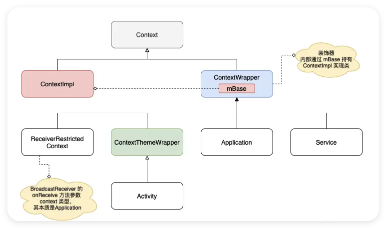

# Context

Context直译过来是“语境”，“上下文”，“环境”的意思。Context 是 Android 系统中用于访问应用程序环境全局信息的抽象类。它提供了访问应用资源、系统服务以及执行应用级操作的接口。

## Context 的继承结构


这里借用网上的一张图来解释，对其内容关心的朋友也可以查看源码：[ContextWrapper.java](https://android.googlesource.com/platform/frameworks/base/+/refs/heads/main/core/java/android/content/ContextWrapper.java)、[ContextImpl.java](https://android.googlesource.com/platform/frameworks/base/+/master/core/java/android/app/ContextImpl.java)

源代码的详解可以看：
https://blog.csdn.net/u010347226/article/details/125812572
https://juejin.cn/post/7382892803313188875#heading-6

重点要关注的是：
1. Activity、Applicantion、Service 都继承了Context，因此他们需要Context的时候都可以直接使用this
2. 因为只有Activity需要指定主题，而Service和Application是不需要使用主题的。因此才有Actvity继承ContextThemeWrapper，而Service和Application直接继承ContextWrapper。
3. Application、Activity、Service通过attach()调用父类ContextWrapper的attachBaseContext(), 从而设置父类成员变量 mBase 为 ContextImpl 对象。

现在便可以搞清楚一个应用程序到底有多少个 Context：

一个Application的基础还是有安卓四大组件构成的：
`Application = Activity + Service + Broadcast Receiver + Content Provider`
因此一个应用的context个数就由其包含了多少个Activity和Service决定，并且最后再加上自己本身持有的context，即
`应用Context数量 = Activity数 + Service数 + 1`

## Context的获取和使用

### 获取方式

| 获取方式               | 代码示例                                      | 适用场景                                                                 |
|------------------------|-----------------------------------------------|--------------------------------------------------------------------------|
| **Application Context** | `val context = applicationContext`<br>`val context = application` | 适用于生命周期较长的对象，如全局变量、工具类等。                         |
| **Activity Context**    | `val context = this`                         | 适用于需要与 UI 交互的场景，如加载布局、启动新 Activity 等。             |
| **Service Context**     | `val context = this`                         | 适用于后台任务，如音乐播放、数据同步等。                                 |
| **BroadcastReceiver Context** | `val context = context`（在 `onReceive()` 中） | 适用于接收广播并执行相关操作。                                           |
| **ContentProvider Context** | `val context = context`（在 `onCreate()` 中） | 适用于提供数据共享功能。                                                 |
| **Fragment Context**    | `val context = context`                      | 适用于 Fragment 内部需要访问应用资源或执行操作的场景。                   |
| **View Context**        | `val context = view.context`                 | 适用于 View 内部需要访问应用资源或执行操作的场景。                       |

注意：
* getApplication()只能在 Activity 和 Service 场景中调用
* getApplicationContext()任意场景中通过 Context 对象皆可以调用

## 作用域

| Context作用域 | Application | Activity | Service |
|---------------|-------------|----------|---------|
| **Show a Dialog** | No          | YES      | NO      |
| **Start an Activity** | 不推荐      | YES      | 不推荐  |
| **Layout Inflation** | 不推荐      | YES      | 不推荐  |
| **Start a Service** | YES         | YES      | YES     |
| **Send a Broadcast** | YES         | YES      | YES     |
| **Register Broadcast Receiver** | YES | YES      | YES     |
| **Load Resource Values** | YES | YES      | YES     |

注意：
* 需要加载布局显示界面的，尽可能的使用 Activity 作为 Context 域，虽然加载布局、启动 Activity 可以使用 Application 和 Service 作为 Context 域，但是不推荐，以免报错或 UI 莫名的使用系统默认的主题 Theme 来展示。
* Dialog 仅能在 Activity 上下文创建

## 使用的注意事项 - 避免内存泄漏

### 静态引用

避免让静态对象持有 Context 的引用，因为静态对象的生命周期可能长于 Context 的生命周期，导致 Context 无法被垃圾回收。
::: code-group

```kotlin [错误示例] {6}
class Singleton {
    companion object {
        private var instance: Singleton? = null
        fun getInstance(context: Context): Singleton {
            if (instance == null) {
                instance = Singleton(context)
            }
            return instance!!
        }
    }

    private var mContext: Context? = null

    private constructor(context: Context) {
        mContext = context
    }
}

// 使用
Singleton.getInstance(this)
```

```kotlin [正确示例] {6}
class Singleton {
    companion object {
        private var instance: Singleton? = null
        fun getInstance(context: Context): Singleton {
            if (instance == null) {
                instance = Singleton(context.applicationContext)
            }
            return instance!!
        }
    }

    private var mContext: Context? = null

    private constructor(context: Context) {
        mContext = context
    }
}

// 使用
Singleton.getInstance(this)
```
:::
Singleton 类中的 mContext 引用了传入的 Context（如 Activity）。如果 Singleton 的生命周期长于 Activity 的生命周期，Activity 对象将无法被垃圾回收，导致内存泄漏。

### 选择合适的 Context

* Application Context：适用于生命周期较长的对象，如全局变量、工具类等。
* Activity Context：适用于需要与 UI 交互的场景，如加载布局、启动新 Activity 等。
* Service Context：适用于后台任务，如音乐播放、数据同步等。

### 避免在匿名内部类或线程中持有 Context

* 匿名内部类：在匿名内部类中使用 Context 可能会导致 Context 泄漏，建议使用静态内部类，并将外部类的引用改为弱引用。

::: code-group

```kotlin [错误示例] {5-8}
class MainActivity : AppCompatActivity() {
    override fun onCreate(savedInstanceState: Bundle?) {
        super.onCreate(savedInstanceState)
        setContentView(R.layout.activity_main)
        val handler = Handler(Looper.getMainLooper()) {
            // 处理消息
            true
        }
    }
}
```

```kotlin [正确示例] {5-9}
class MainActivity : AppCompatActivity() {
    override fun onCreate(savedInstanceState: Bundle?) {
        super.onCreate(savedInstanceState)
        setContentView(R.layout.activity_main)
        val handler = object : Handler(Looper.getMainLooper()) {
            override fun handleMessage(msg: Message) {
                // 处理消息
            }
        }
    }
}
```
:::

在这个示例中，Handler 是一个匿名内部类。匿名内部类会隐式地持有外部类（MainActivity）的引用。如果 Handler 的生命周期长于 Activity 的生命周期（例如，Handler 在一个长时间运行的线程中处理消息），Activity 对象将无法被垃圾回收，导致内存泄漏。

而正确的处理方式将 Handler 定义为静态内部类，避免隐式持有外部类的引用。

* 线程：在线程中使用 Context 时，确保线程的生命周期不会长于 Context 的生命周期。

::: code-group

```kotlin [错误示例] {5}
class MainActivity : AppCompatActivity() {
    override fun onCreate(savedInstanceState: Bundle?) {
        super.onCreate(savedInstanceState)
        setContentView(R.layout.activity_main)
        val context = this
        Thread {
            // 使用 context
        }.start()
    }
}
```

```kotlin [正确示例] {5}
class MainActivity : AppCompatActivity() {
    override fun onCreate(savedInstanceState: Bundle?) {
        super.onCreate(savedInstanceState)
        setContentView(R.layout.activity_main)
        val context = applicationContext
        Thread {
            // 使用 context
        }.start()
    }
}
```
:::


### 正确使用 Context

* 启动 Activity：必须使用 Activity 的 Context，因为启动 Activity 需要任务栈支持。
* 弹出 Dialog：必须使用 Activity 的 Context，因为 Dialog 需要基于 Activity 弹出。
* 加载资源：可以使用 Application 或 Activity 的 Context。

### 避免使用静态 View 对象

静态 View：静态 View 对象会持有 Activity 的引用，导致 Activity 无法被垃圾回收。
示例：静态 Drawable 对象持有 Activity 的引用，导致 Activity 泄漏。

::: code-group

```kotlin [错误示例] {2-4}
class MainActivity : AppCompatActivity() {
    companion object {
        lateinit var mDrawable: Drawable
    }

    override fun onCreate(savedInstanceState: Bundle?) {
        super.onCreate(savedInstanceState)
        setContentView(R.layout.activity_main)
        mDrawable = resources.getDrawable(R.drawable.ic_launcher)
    }
}
```

```kotlin [正确示例] {2}
class MainActivity : AppCompatActivity() {
    private var mDrawable: Drawable? = null

    override fun onCreate(savedInstanceState: Bundle?) {
        super.onCreate(savedInstanceState)
        setContentView(R.layout.activity_main)
        mDrawable = resources.getDrawable(R.drawable.ic_launcher)
    }
}
```
:::


