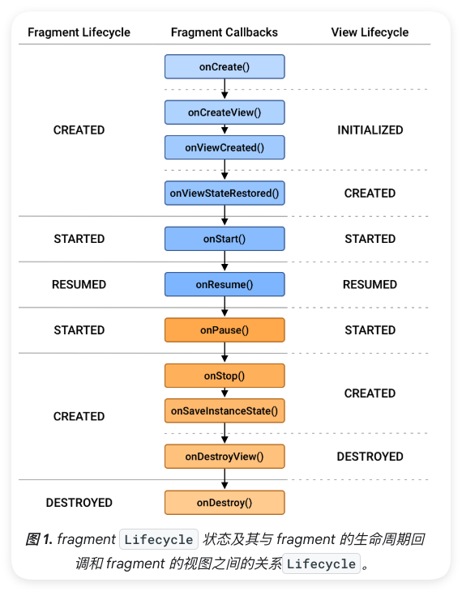

# Fragment

Fragment是Android中的一种组件，直译为“碎片”或“片段”，可以看作是Activity的模块化部分，Fragment 可以将 Activity 视图拆分为多个区块进行模块化地管理 ，避免了 Activity 视图代码过度臃肿混乱。在官方的定义中Fragment 表示应用界面中可重复使用的一部分。

- fragment 定义和管理自己的布局，具有自己的生命周期，并且可以处理自己的输入事件
- fragment 不能独立存在。它们必须由 activity 或其他 fragment 托管
- fragment 的视图层次结构会成为宿主的视图层次结构的一部分，或附加到宿主的视图层次结构。
- Fragment可以被多个Activity复用，提高了代码的复用率。在模块化开发中，一个Fragment可以代表一个独立的业务模块，从而在不同的地方重复使用。

## 添加方式

### 静态添加  
**定义**：直接在 XML 布局文件中声明 Fragment，适用于固定展示的视图组件。这种方式添加后一般不可在运行时删除或更换。

#### 实现步骤  
1. 创建 Fragment 的布局文件（如 `fragment_my.xml`）。  
2. 在 Activity 或父 Fragment 的布局文件中使用 `<fragment>` 标签。  
3. 通过 `android:name` 属性指定 Fragment 类的全限定名（包名 + 类名）。  

#### 示例代码  
```xml  
<!-- activity_main.xml -->  
<LinearLayout  
    xmlns:android="http://schemas.android.com/apk/res/android"  
    android:layout_width="match_parent"  
    android:layout_height="match_parent">  

    <!-- 静态添加 Fragment -->  
    <fragment  
        android:id="@+id/staticFragment"  
        android:name="com.example.app.MyFragment"  
        android:layout_width="match_parent"  
        android:layout_height="200dp" />  
</LinearLayout>  
```  

#### 注意事项  
- **不可动态修改**：无法通过代码移除或替换已静态添加的 Fragment。  
- **必须声明唯一标识**：需设置 `android:id` 或 `android:tag` 属性以便查找。  
- **生命周期依赖**：Fragment 会随 Activity 的 `onCreate()` 自动初始化。  


### 动态添加  
**定义**：通过代码管理 Fragment 的增删替换，适用于交互场景（如 Tab 切换、页面导航）。  

#### 实现步骤  
1. 在布局文件中定义容器（如 `FrameLayout`）。  
2. 通过 `FragmentManager` 启动事务（`beginTransaction()`）。  
3. 使用事务方法（`add()`/`replace()`/`remove()`）操作 Fragment。  
4. 提交事务（`commit()`）。  

#### 示例代码  
```kotlin  
// 1. 定义容器布局  
<!-- activity_main.xml -->  
<FrameLayout  
    android:id="@+id/fragmentContainer"  
    android:layout_width="match_parent"  
    android:layout_height="match_parent" />  

// 2. 动态添加 Fragment  
class MainActivity : AppCompatActivity() {  
    override fun onCreate(savedInstanceState: Bundle?) {  
        super.onCreate(savedInstanceState)  
        setContentView(R.layout.activity_main)  

        // 创建 Fragment 实例  
        val dynamicFragment = MyFragment()  

        // 执行事务  
        supportFragmentManager.beginTransaction().apply {  
            replace(R.id.fragmentContainer, dynamicFragment, "DynamicFragmentTag")  
            setTransition(FragmentTransaction.TRANSIT_FRAGMENT_FADE) // 过渡动画  
            addToBackStack("transaction_tag") // 加入回退栈  
            commit()  
        }  
    }  
}  
```  

#### 核心方法  

| 方法                | 说明                                                                 |  
|---------------------|----------------------------------------------------------------------|  
| `add()`             | 向容器中叠加 Fragment，保留原有视图（适合多 Fragment 层叠场景）。     |  
| `replace()`         | 清空容器后添加新 Fragment（适合单视图切换场景）。                     |  
| `remove()`          | 从容器中移除已添加的 Fragment。                                      |  
| `addToBackStack()`  | 将事务加入回退栈，用户按返回键时可回滚操作。                         |  


#### 注意事项  
- **容器要求**：容器必须是 `ViewGroup`（如 `FrameLayout`、`ConstraintLayout`）。  
- **事务提交时机**：避免在 `onSaveInstanceState()` 后调用 `commit()`（可能导致状态丢失）。  
- **回退栈管理**：若未调用 `addToBackStack()`，返回键会直接关闭 Activity 而非回退 Fragment。  
- **异步安全**：使用 `commitAllowingStateLoss()` 在极端场景（如应用后台）提交事务，但可能丢失状态。  


## 生命周期

Fragment的生命周期状态有以下五个：
* INITIALIZED
* CREATED
* STARTED
* RESUMED
* DESTROYED

Fragment的生命周期回调方法有12个，比Activity多了好些个，如图所示：



### Fragment 的 12 个生命周期方法

| 生命周期方法          | 触发时机                                                                 | 典型用途                                                                 |
|-----------------------|--------------------------------------------------------------------------|--------------------------------------------------------------------------|
| **1. onAttach()**     | Fragment 与宿主 Activity 建立关联时                                     | 获取 Activity 引用，初始化通信接口                                        |        
| **2. onCreate()**     | Fragment 初始化时（视图创建前）                                          | 初始化非视图数据，恢复保存状态                                            | 
| **3. onCreateView()**  | 创建 Fragment 的 UI 视图时                                               | 加载布局文件，绑定基础视图组件                                            | 
| **4. onViewCreated()**| 视图层级创建完成后立即调用                                               | 视图初始化、设置监听器、加载动态数据                                      |            
| **5. onActivityCreated()**  | 宿主 Activity 的 `onCreate()` 完成时（已过时，建议用 `onViewCreated` 替代） | 执行需要 Activity 完全初始化的操作                                        |       
| **6. onStart()**      | Fragment 可见但不可交互时                                                 | 启动轻量级后台任务                                                        | 
| **7. onResume()**     | Fragment 进入可交互状态                                                   | 注册传感器监听、启动动画                                                  | 
| **8. onPause()**      | Fragment 即将失去焦点时                                                   | 提交未保存数据、释放高耗能资源                                            | 
| **9. onStop()**       | Fragment 完全不可见时                                                     | 停止所有后台任务                                                          | 
| **10. onDestroyView()**  | 视图层级被销毁时                                                         | 解绑视图引用（如 ViewBinding）、清理视图相关资源                           | 
| **11. onDestroy()**   | Fragment 即将被销毁时                                                     | 释放全局资源、断开数据库连接                                              | 
| **12. onDetach()**    | Fragment 与 Activity 解除关联时                                           | 清空 Activity 引用防止内存泄漏                                            |


### 生命周期的影响因素 

Fragment 生命周期与宿主同步的吗？并不是，Fragment 的生命周期主要受「宿主」、「事务」、「setRetainInstance() API」三个因素影响：当宿主生命周期发生变化时，会触发 Fragment 状态转移到 宿主的最新状态。不过，使用事务和 setRetainInstance() API 也可以使 Fragment 在一定程度上与宿主状态不同步（需要注意：宿主依然在一定程度上形成约束）。

### 宿主如何改变 Fragment 状态

结论：当宿主生命周期发生变化时，Fragment 的状态会同步到宿主的状态。
原因：宿主生命周期回调中会调用 FragmentManager 中一系列 dispatchXXX() 方法来触发 Fragment 状态转移。

```kotlin
@Override
protected void onCreate(@Nullable Bundle savedInstanceState) {
    mFragments.attachHost(null /*parent*/);
    ...
    mFragments.dispatchCreate(); // 最终调用 FragmentManager#dispatchCreate()
}
```
其中状态改变的关系图如下：
首次启动

| 调用顺序 | 组件      | 回调方法           |
|----------|-----------|--------------------|
| 1        | ⭐Activity  | onCreate           |
| 2        | ✅Fragment  | onAttach           |
| 3        | ✅Fragment  | onCreate           |
| 4        | ✅Fragment  | onCreateView       |
| 5        | ✅Fragment  | onViewCreated      |
| 6        | ⭐Activity  | onStart            |
| 7        | ✅Fragment  | onActivityCreated  |
| 8        | ✅Fragment  | onStart            |
| 9        | ⭐Activity  | onResume           |
| 10       | ✅Fragment  | onResume           |


退出

| 调用顺序 | 组件      | 回调方法         |
|----------|-----------|------------------|
| 1        | ⭐Activity  | onPause          |
| 2        | ✅Fragment  | onPause          |
| 3        | ⭐Activity  | onStop           |
| 4        | ✅Fragment  | onStop           |
| 5        | ⭐Activity  | onDestroy        |
| 6        | ✅Fragment  | onDestroyView    |
| 7        | ✅Fragment  | onDestroy        |
| 8        | ✅Fragment  | onDetach         |


回到桌面

| 调用顺序 | 组件      | 回调方法   |
|----------|-----------|------------|
| 1        | ⭐Activity  | onPause    |
| 2        | ✅Fragment  | onPause    |
| 3        | ⭐Activity  | onStop     |
| 4        | ✅Fragment  | onStop     |


 返回

| 调用顺序 | 组件      | 回调方法   |
|----------|-----------|------------|
| 1        | ⭐Activity  | onStart    |
| 2        | ✅Fragment  | onStart    |
| 3        | ⭐Activity  | onResume   |
| 4        | ✅Fragment  | onResume   |

可以看出，Activity 的生命周期的变化会带动 Fragment 的一个甚至多个生命周期的变化。


### 事务管理

在运行时，FragmentManager 可以通过 Fragment 执行添加、移除、替换以及其他操作，以响应用户互动。每组 Fragment 更改称为一个“事务”，并且可以使用 FragmentTransaction 类提供的 API 指定在事务内需执行何种操作。

使用事务 FragmentTransaction 可以动态改变 Fragment 状态，使得 Fragment 在一定程度脱离宿主的状态。不过，事务依然受到宿主状态约束，例如：当前 Activity 处于 STARTED 状态，那么 addFragment 不会使得 Fragment 进入 RESUME 状态。只有将来 Activity 进入 RESUME 状态时，才会同步 Fragment 到最新状态。

#### 事务的操作
Fragment的事务操作有如下几个：
* add & remove：Fragment 状态在 INITIALIZING 与 RESUMED 之间转移；
* detach & attach： Fragment 状态在 CREATE 与 RESUMED 之间转移；
* replace： 先移除所有 containerId 中的实例，再 add 一个 Fragment；
* show & hide： 只控制 Fragment 隐藏或显示，不会触发状态转移，也不会销毁 Fragment 视图或实例；
* hide & detach & remove 的区别： hide 不会销毁视图和实例、detach 只销毁视图不销毁实例、remove 会销毁实例（自然也销毁视图）。不过，如果 remove 的时候将事务添加到回退栈，那么 Fragment 实例就不会被销毁，只会销毁视图。

#### 事务的提交

每个 FragmentTransaction 上的最终调用必须提交事务。commit() 调用会向 FragmentManager 发出信号，指明所有操作均已添加到事务中。FragmentTransaction 定义了 5 种提交方式：

| 提交方法                      | 是否允许状态丢失 | 是否异步执行 | 说明 |
|------------------------------|------------------|--------------|------|
| `commit()`                   | ❌ 不允许         | ✅ 是         | 最常用的提交方式，如果在 `onSaveInstanceState()` 之后调用，可能会抛异常 |
| `commitAllowingStateLoss()`  | ✅ 允许           | ✅ 是         | 可在状态保存后调用，但有丢失状态的风险，适合不重要的 UI 更新 |
| `commitNow()`                | ❌ 不允许         | ❌ 否         | 立即执行事务（同步），只能在主线程使用，不能用于添加到回退栈的事务 |
| `commitNowAllowingStateLoss()` | ✅ 允许         | ❌ 否         | 立即执行事务（同步），允许状态丢失，适用于紧急但非关键的界面变更 |
| `runOnCommit(Runnable)`     | -                | -            | 在 commit 之后立即运行回调，常用于执行额外逻辑（API 24+） |

## 实际运用

现在的Fragment基本上基于Jetpack Navigation Component 实现。

### Fragment 与 Activity（以及 Fragment 之间）的数据传递

一、Fragment ⇄ Activity 数据传递

1. **通过 Bundle 传递（单向初始化数据）**
**适用场景**：Activity 向 Fragment 传递初始参数  

**实现步骤**：  
```kotlin  
// Activity 端  
val fragment = MyFragment().apply {  
    arguments = bundleOf("KEY_NAME" to "Alice", "KEY_AGE" to 25)  
}  
supportFragmentManager.beginTransaction().replace(R.id.container, fragment).commit()  

// Fragment 端  
val name = arguments?.getString("KEY_NAME")  
val age = arguments?.getInt("KEY_AGE", 0)  
``` 


2. **通过 ViewModel 共享数据（双向实时同步）**  
**适用场景**：需要跨组件实时共享数据  

**实现步骤**：  
```kotlin  
// 定义共享 ViewModel  
class SharedViewModel : ViewModel() {  
    val liveData = MutableLiveData<String>()  
}  

// Activity 端  
val viewModel by viewModels<SharedViewModel>()  
viewModel.liveData.value = "Hello from Activity"  

// Fragment 端  
val viewModel by activityViewModels<SharedViewModel>()  
viewModel.liveData.observe(viewLifecycleOwner) { data ->  
    textView.text = data  
}  

// Fragment 更新数据  
viewModel.liveData.value = "Hello from Fragment"  
``` 


#### 3. **接口回调（Fragment → Activity 通信）**  
**适用场景**：Fragment 向宿主 Activity 发送事件  

**实现步骤**：  
```kotlin  
// 定义接口  
interface OnButtonClickListener {  
    fun onButtonClicked(message: String)  
}  

// Fragment 端  
class MyFragment : Fragment() {  
    private var listener: OnButtonClickListener? = null  

    override fun onAttach(context: Context) {  
        super.onAttach(context)  
        listener = context as? OnButtonClickListener  
    }  

    fun sendDataToActivity() {  
        listener?.onButtonClicked("Button Clicked!")  
    }  
}  

// Activity 端  
class MainActivity : AppCompatActivity(), OnButtonClickListener {  
    override fun onButtonClicked(message: String) {  
        Toast.makeText(this, message, Toast.LENGTH_SHORT).show()  
    }  
}  
```


#### 4. **直接访问公有方法**  
**适用场景**：Activity 主动获取 Fragment 数据  

**实现步骤**：  
```kotlin  
// Fragment 定义公有方法  
fun getCurrentData(): String = "Data from Fragment"  

// Activity 端  
val fragment = supportFragmentManager.findFragmentById(R.id.fragment) as? MyFragment  
val data = fragment?.getCurrentData()  
```

二、Fragment ⇄ Fragment 数据传递

#### 1. **通过共享 ViewModel**  
**适用场景**：兄弟 Fragment 间实时通信  

**实现步骤**：  
```kotlin  
// Fragment A 发送数据  
sharedViewModel.liveData.value = "Message from Fragment A"  

// Fragment B 接收数据  
sharedViewModel.liveData.observe(viewLifecycleOwner) {  
    textView.text = it  
}  
```

#### 2. **通过宿主 Activity 中转**  
**实现步骤**：  
```kotlin  
// Fragment A → Activity  
(activity as? MainActivity)?.receiveDataFromFragment("Data from A")  

// Activity → Fragment B  
supportFragmentManager.setFragmentResult("REQUEST_KEY", bundleOf("DATA_KEY" to data))  

// Fragment B 监听  
childFragmentManager.setFragmentResultListener("REQUEST_KEY", viewLifecycleOwner) { _, bundle ->  
    val data = bundle.getString("DATA_KEY")  
}  
```

#### 3. **使用 Fragment Result API**  
**实现步骤**：  
```kotlin  
// Fragment A 发送数据  
setFragmentResult("REQUEST_KEY", bundleOf("DATA_KEY" to "Hello"))  

// Fragment B 接收（在 onCreate 或 onViewCreated 中注册）  
parentFragmentManager.setFragmentResultListener("REQUEST_KEY", viewLifecycleOwner) { key, bundle ->  
    if (key == "REQUEST_KEY") {  
        val data = bundle.getString("DATA_KEY")  
    }  
}  
```

三、方案对比  

| 方法               | 优点                          | 缺点                          | 适用场景                  |  
|--------------------|-------------------------------|-------------------------------|--------------------------|  
| Bundle             | 简单直接                      | 只能单向初始化时传递           | 初始化参数传递           |  
| ViewModel          | 数据持久化，双向实时同步        | 需要理解生命周期作用域         | 复杂数据共享            |  
| 接口回调           | 类型安全                      | 需要维护接口引用               | 事件通知场景            |  
| Fragment Result API| 解耦组件                      | 需处理请求键管理               | 简单结果返回            |  


### 特殊场景处理  
#### 1. 状态保存与恢复  
**问题背景**：当系统因内存不足或配置变更（如屏幕旋转）需要重建 Fragment 时，临时数据会丢失。需手动保存/恢复关键状态。  

**实现方案**：  
```kotlin  
// 保存状态（在 Fragment 被销毁前调用）  
override fun onSaveInstanceState(outState: Bundle) {  
    super.onSaveInstanceState(outState)  
    outState.putString("inputText", editText.text.toString()) // 保存输入框文本  
}  

// 恢复状态（在视图重建后调用）  
override fun onViewStateRestored(savedInstanceState: Bundle?) {  
    super.onViewStateRestored(savedInstanceState)  
    val savedText = savedInstanceState?.getString("inputText")  
    editText.setText(savedText) // 恢复文本到输入框  
}  
``` 

**关键说明**：  
- `onSaveInstanceState` 触发时机：  
  - 按下 Home 键/切换应用  
  - 屏幕旋转等配置变更  
  - 系统主动回收内存  
- `onViewStateRestored` 与 `onCreateView` 的区别：  
  - `onCreateView` 仅创建视图，此时 Bundle 可能未恢复  
  - `onViewStateRestored` 保证数据已恢复，适合初始化 UI 状态  


#### 2. 配置变更处理（屏幕旋转）  
**问题背景**：默认情况下，屏幕旋转会触发 Activity/Fragment 重建，导致临时数据丢失。可通过两种方案处理：  

**方案一：允许重建但保存状态（推荐）**  
```kotlin  
// 不声明 configChanges，依赖 ViewModel + onSaveInstanceState 自动保存  
class MyFragment : Fragment() {  
    private val viewModel: MyViewModel by viewModels()  
    // 业务逻辑无需特殊处理  
}  
``` 

**方案二：禁止重建，手动调整布局**  
```kotlin  
// Step1: 在 AndroidManifest.xml 中声明  
<activity  
    android:name=".MainActivity"  
    android:configChanges="orientation|screenSize|keyboardHidden">  
</activity>  

// Step2: 在 Fragment 中响应配置变更  
override fun onConfigurationChanged(newConfig: Configuration) {  
    super.onConfigurationChanged(newConfig)  
    if (newConfig.orientation == Configuration.ORIENTATION_LANDSCAPE) {  
        // 横屏布局调整  
        recyclerView.layoutManager = GridLayoutManager(context, 4)  
    } else {  
        // 竖屏布局调整  
        recyclerView.layoutManager = LinearLayoutManager(context)  
    }  
}  
```  

**方案对比**：  
|          | 自动重建 + 状态保存                     | 手动处理配置变更                 |  
|----------|---------------------------------------|---------------------------------|  
| **优点** | 代码简单，系统自动处理                  | 避免 UI 闪烁，提升性能           |  
| **缺点** | 会有短暂重建过程                        | 需适配所有可能的配置变更组合      |  
| **建议** | 默认使用（配合 ViewModel）              | 仅用于性能敏感场景（如游戏、视频） |  


### 最佳实践  
1. **视图绑定**：在 `onCreateView()` 中初始化视图，在 `onDestroyView()` 中释放  
2. **异步操作**：在 `onResume()` 启动任务，在 `onPause()` 停止任务  
3. **内存管理**：避免在 Fragment 中持有 Activity 的强引用  
4. **状态恢复**：始终通过 `savedInstanceState` 处理配置变更  
5. **通信机制**：使用 `ViewModel` + `LiveData` 替代直接与 Activity 交互  