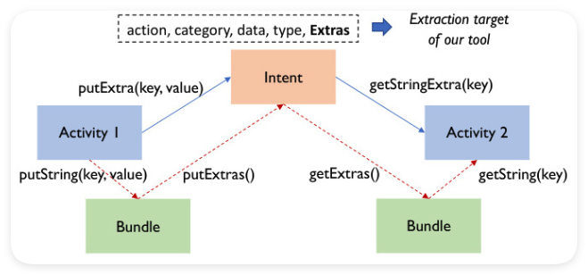

# Intent

Intent，中文可翻译为“意图”，可用于Android同个应用程序中各个组件之间的交互，或者不同应用程序之间的交互。可以用来表明当前组件的思想和意图，比如想执行某个动作，想发送某些数据等等。每个组件都有不同的启动方法：

* Activity：可以调用startActivity() 或 startActivityForResult() 传递 Intent来打开新的Activity
* Service：可以调用startService()传递 Intent 来启动服务，也可通过 bindService() 传递 Intent 来绑定到该服务
* Broadcast，可以调用sendBroadcast()、sendOrderedBroadcast() 或 sendStickyBroadcast() 等方法传递 Intent 来发起广播

## Intent的显式和隐式

**显式Intent**
显式 Intent： 直接指定目标 Activity 的类名，​​适用于同一应用内的跳转​​。
显式 Intent 通常用于应用内部的组件通信，例如从一个 Activity 跳转到另一个 Activity，或者启动一个 Service。

示例：
```kotin
Intent intent = new Intent(MainActivity.this, second_activity.class);
startActivity(intent);
```

**隐式 Intent**
隐式 Intent 是一种通过描述要执行的动作和数据类型来间接指定目标组件的意图。它不直接指定目标组件，而是通过声明要执行的操作（如 ACTION_VIEW、ACTION_SEND）和数据类型（如 image/*、text/plain），让系统根据 Intent Filter 匹配合适的组件来处理请求。隐式 Intent 通常用于跨应用的通信，例如打开浏览器、发送短信等。

示例：
```kotlin
// 隐式启动一个浏览器打开网页（需要匹配系统浏览器的 Intent Filter）
Intent implicitIntent = new Intent();
implicitIntent.setAction(Intent.ACTION_VIEW);          // 设置 Action
implicitIntent.setData(Uri.parse("https://www.google.com"));  // 设置 Data（URL）

// 检查是否有 Activity 能处理此 Intent（避免崩溃）
if (implicitIntent.resolveActivity(getPackageManager()) != null) {
    startActivity(implicitIntent);
}
```

* 如果有多个应用响应隐式 intent，则用户可以选择要使用的应用，并将其设置为该操作的默认选项。
* 如果多个应用可以响应 intent，且用户可能希望每次使用不同的应用，则应采用显式方式显示选择器对话框。需要使用 createChooser() 创建 Intent 并将其传递给 startActivity()

Activity 需要配置 action 和 category：
```xml
       <activity
           android:name=".second_activity"
           android:exported="true">
           <intent-filter>
               <action android:name="com.example.intent.MainActivity"/>
               <category android:name="android.intent.category.DEFAULT"/>
           </intent-filter>
       </activity>

```
只有`<action＞`和`<category>`中的内容同时能够匹配上Intent中指定的action和category时，这个活动才能响应该Intent


| 特点                 | 显式 Intent                                      | 隐式 Intent                                      |
|----------------------|-------------------------------------------------|-------------------------------------------------|
| **目标指定方式**     | 明确指定目标组件的类名或标识符。                | 通过动作和数据类型描述要执行的操作，不直接指定目标组件。 |
| **使用场景**         | 应用内部组件通信，如 Activity 之间的跳转。      | 跨应用通信，如打开相机、分享内容、发送短信等。  |
| **安全性**           | 高，因为目标组件明确。                          | 较低，因为系统会匹配多个可能的组件。             |
| **灵活性**           | 低，目标组件固定。                              | 高，系统会根据 Intent Filter 自动匹配合适的组件。 |
| **示例**             | 启动应用内的另一个 Activity。                   | 打开浏览器查看网页。                            |

## Intent的组成部分

一个Intent的组成可以包括：
* componentName：目的组件
* action（动作）：用来表现意图的行动
* category（类别）：用来表现动作的类别
* data（数据）：表示与动作要操纵的数据
* type（数据类型）：对于data范例的描写
* extras（扩展信息）：扩展信息
* Flags（标志位）：期望这个意图的运行模式

### componentName

如果直接指定了componentName，那就是显式Intent，可以通过setComponent()、setClass()、setClassName()等方法指定：
::: code-group

```kotlin [setComponent()方式]
val intent = Intent()
val componentName = ComponentName(this, "com.example.targetapp.TargetActivity")
intent.component = componentName
startActivity(intent)
```

```kotlin [setClass()方式]
val intent = Intent()
intent.setClass(this, TargetActivity::class.java)
startActivity(intent)
```

```kotlin [setClassName()方式]
val intent = Intent()
intent.setClassName(this, "com.example.targetapp.TargetActivity")
startActivity(intent)
```
:::

一般第二种方式用的多。

### Action（动作）
表示意图要执行的抽象操作，例如查看（ACTION_VIEW）、编辑（ACTION_EDIT）等。系统预定义了大量标准动作，开发者也可自定义（需包含包名前缀，如com.example.SHOW_COLOR）。动作本身不指定具体组件，而是通过匹配接收组件的`<intent-filter>`来确定执行

Action 列表请见：https://developer.android.com/reference/android/content/Intent#ACTION_AIRPLANE_MODE_CHANGED

### Category（类别）
* 为动作提供附加信息，用于进一步限定意图的适用场景。
* 如果使用了 action，那么 category 必须填写，无论有没有特殊的 category，默认的那个 category(android.intent.category.DEFAULT)是必须填写上的
例如：

CATEGORY_LAUNCHER：表示组件应显示在桌面启动器中作为顶级应用入口。
CATEGORY_ALTERNATIVE：表示该意图是一组针对同一数据可选的备选操作之一。
一个Intent可包含多个Category，通过addCategory()方法添加

Category 列表请见：https://developer.android.com/reference/android/content/Intent#CATEGORY_ACCESSIBILITY_SHORTCUT_TARGET

### Data（数据）
以URI形式指定操作涉及的具体数据。例如：

tel:123456表示电话号码，配套动作为ACTION_DIAL（拨号）。
`[http://example.com ](http://example.com )`表示网页地址，配套动作为ACTION_VIEW。
数据URI需与动作类型匹配，如编辑联系人时需使用content://contacts/1格式

### Type（数据类型）
显式指定数据的MIME类型（如text/plain或image/jpeg），覆盖系统自动推断的类型。例如，强制要求处理组件接收纯文本数据时，可设置type="text/plain"。若同时设置data和type，需调用setDataAndType()方法以避免冲突

### Extras（扩展信息）
通过键值对（Bundle对象）传递附加数据。例如：

发送邮件时，可通过putExtra(Intent.EXTRA_SUBJECT, "标题")设置邮件主题。
使用getExtras()方法可读取接收方传递的额外信息。
支持多种数据类型，包括基本类型、字符串、序列化对象等。

Extras 列表请见：https://developer.android.com/reference/android/content/Intent#EXTRA_ALARM_COUNT

### Flags（标志位）
控制组件的启动模式及任务栈行为。常用标志包括：

FLAG_ACTIVITY_NEW_TASK：在新任务栈中启动Activity。
FLAG_ACTIVITY_CLEAR_TOP：若目标Activity已在栈中，则清除其上的所有其他Activity。
通过setFlags()方法设置，可组合多个标志以定义复杂行为。

Flags 列表请见：https://developer.android.com/reference/android/content/Intent#FLAG_ACTIVITY_BROUGHT_TO_FRONT

## 使用Intent在活动间传递数据
前面已经提到了Extras通过键值对（Bundle对象）传递附加数据。其方式分为以下几种

### 基础数据传递：通过 putExtra() 和 getExtra()

1. 单向传递数据（启动活动时传递）

* 发送方：通过 Intent.putExtra(key, value) 附加数据。
```
val intent = Intent(this, TargetActivity::class.java)
intent.putExtra("username", "John")       // 字符串
intent.putExtra("score", 95)              // 整型
intent.putExtra("isPremium", true)        // 布尔型
startActivity(intent)
```

* 接收方：通过 getIntent().getXxxExtra(key) 获取数据。
```
val username = intent.getStringExtra("username")
val score = intent.getIntExtra("score", 0) // 默认值0
val isPremium = intent.getBooleanExtra("isPremium", false)
```
适用场景：简单数据类型（字符串、数值、布尔）的单向传递

2. 传递复杂数据（对象）

* 自定义对象需实现 Parcelable 或 Serializable 接口：
```
data class User(val name: String, val age: Int) : Parcelable {
    // Parcelable实现代码（略）
}
```

* 发送方
```
intent.putExtra("user", userObject) // 直接传递对象
```

* 接收方
```
val user = intent.getParcelableExtra<User>("user")
```

### 使用 Bundle 封装多组数据

1. 创建并填充 Bundle

* 发送方：将数据打包为 Bundle 对象。
```
val bundle = Bundle().apply {
    putString("title", "Welcome")
    putInt("page", 1)
}
intent.putExtras(bundle)
```

* 接收方：通过 getExtras() 获取 Bundle 并解析。
```
val extras = intent.extras
val title = extras?.getString("title")
val page = extras?.getInt("page", 1)
```
适用场景：需要批量传递多组关联数据

**Bundle 的优势**
* 统一管理键值对，避免多次调用 putExtra()。
* 支持通过 Bundle.getBundle(key) 嵌套传递多个 Bundle。
* 可用于跨进程通信（IPC）的场景

### 双向数据传递：startActivityForResult()

1. 发送请求并接收返回数据

* 发送方：通过 startActivityForResult() 启动活动。
```
private val REQUEST_CODE = 1001

val intent = Intent(this, EditActivity::class.java)
startActivityForResult(intent, REQUEST_CODE)
```

* 接收方：设置返回数据并结束活动。
```
val resultIntent = Intent()
resultIntent.putExtra("editedText", newText)
setResult(RESULT_OK, resultIntent)
finish()
```

* 发送方处理结果：重写 onActivityResult()。
```
override fun onActivityResult(requestCode: Int, resultCode: Int, Intent?) {
    if (requestCode == REQUEST_CODE && resultCode == RESULT_OK) {
        val editedText = data?.getStringExtra("editedText")
        // 更新UI
    }
}
```
适用场景：表单编辑、配置选择等需要返回结果的场景。

2. 替代方案：Activity Result API

* 使用 registerForActivityResult() 简化回调逻辑：
```
val launcher = registerForActivityResult(ActivityResultContracts.StartActivityForResult()) { result ->
    if (result.resultCode == RESULT_OK) {
        val data = result.data?.getStringExtra("data")
        // 处理数据
    }
}
launcher.launch(Intent(this, TargetActivity::class.java))
```
优势：解耦请求和回调，避免代码臃肿


## 最佳实践与注意事项

### 1. **安全使用 `resolveActivity()` 检查 Intent 是否可执行**  
**核心逻辑**：在调用 `startActivity()` 前，必须验证是否有组件能处理该 Intent，避免因无匹配 Activity 导致崩溃。  

**实现方式**：  
```kotlin
// 示例：启动地图应用前检查
val mapIntent = Intent(Intent.ACTION_VIEW, Uri.parse("geo:0,0?q=Beijing"))
if (mapIntent.resolveActivity(packageManager) != null) {
    startActivity(mapIntent)
} else {
    // 降级处理：跳转网页版或提示用户
    Toast.makeText(this, "未安装地图应用", Toast.LENGTH_SHORT).show()
    binding.mapButton.isEnabled = false // 停用相关功能
}
```

**注意事项**：  
- **隐式 Intent 必须检查**：显式 Intent（明确指定 `ComponentName`）无需检查。  
- **适配多场景**：根据业务需求提供备选方案（如 Web 链接、功能禁用）。  
- **用户提示**：若无法执行，需明确告知用户原因。

### 2. **数据大小限制与优化策略**  
**关键限制**：  
- **Binder 传输阈值**：Intent 数据总量不应超过 **1MB**（实际因设备而异），否则会抛出 `TransactionTooLargeException`。  
- **位图传递问题**：避免直接通过 `Intent` 传递大位图（如 `Bitmap` 对象），改用 URI 或文件路径。  

**优化方案**：  
- **使用 URI 传递文件**：  
 ```kotlin
  // 发送方：通过 FileProvider 共享文件
  val file = File(context.filesDir, "large_image.jpg")
  val uri = FileProvider.getUriForFile(context, "${context.packageName}.provider", file)
  val intent = Intent(Intent.ACTION_SEND).apply {
      type = "image/jpeg"
      putExtra(Intent.EXTRA_STREAM, uri)
      addFlags(Intent.FLAG_GRANT_READ_URI_PERMISSION) // 授权临时读取权限
  }
  ```

- **避免序列化大数据**：  

```kotlin
// 错误做法：直接传递大对象
intent.putExtra("largeData", heavyObject)

// 正确做法：通过全局单例或数据库共享
DataCache.instance.largeData = heavyObject
```
### 3. **使用 ADB 验证 Intent 的解析与执行**  
**调试场景**：快速测试 Intent 能否被系统正确识别，无需编写完整 UI 逻辑。  

**命令语法**：  
```shell
adb shell am start -a <ACTION> -t <MIME_TYPE> -d <DATA_URI> -n <COMPONENT>
```

**常用示例**：  
- **测试网页跳转**：  
```shell
adb shell am start -a android.intent.action.VIEW -d "https://example.com"
```

- **验证自定义 Action**：  
```shell
adb shell am start -a com.example.action.SHOW_DETAIL -n com.example/.DetailActivity
```

- **发送带 Extra 的 Intent**：  
```shell
adb shell am start -a android.intent.action.SEND -t text/plain --es android.intent.extra.TEXT "Hello ADB"
```

**调试技巧**：  
- 使用 `adb logcat` 查看 `ActivityManager` 日志，定位 Intent 匹配失败原因。  
- 通过 `-e` 参数添加扩展数据（如 `--es key value` 表示字符串，`--ei key 123` 表示整型）。


### 4. **其他注意事项**  
**显式与隐式 Intent 的选择**：  
- 应用内部跳转优先使用显式 Intent（明确指定目标类名），避免被恶意应用劫持。  
- 跨应用交互使用隐式 Intent 时，需严格定义 `<intent-filter>` 的 `mimeType` 和 `data` 属性。  

**敏感数据保护**：  
- 通过 `Intent.FLAG_GRANT_READ_URI_PERMISSION` 限制 URI 权限，防止数据泄露。  
- 避免在 Intent 中传递密码、令牌等敏感信息，改用 `SecureSharedPreferences` 或 `BiometricPrompt`。  

**版本兼容性**：  
- 对 Android 11+ 设备，需在 `AndroidManifest.xml` 声明 `<queries>` 标签，才能拥有查询其他应用的 Intent 处理能力。 可以参考：https://blog.51cto.com/u_16213420/12610693 
```xml
<queries>
    <!-- 声明需要查询的 Intent Action -->
    <intent>
        <action android:name="android.intent.action.SEND" />
        <data android:mimeType="image/*" />
    </intent>
</queries>
```