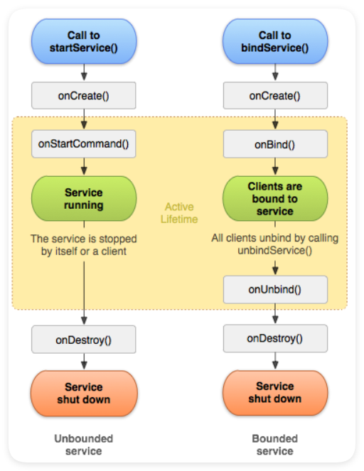

# Service

Service 是 Android 四大组件之一，它是一个没有用户界面的后台组件，用于执行长时间运行的任务。Service 服务可以在后台处理网络事务、播放音乐、执行文件 I/O 或与 content provider 交互，而不会因为用户界面的切换或关闭而中断。

## Service 基础概念与核心机制

### Service 的创建
示例代码：
```kotlin
class MyService : Service() {

    override fun onStartCommand(intent: Intent?, flags: Int, startId: Int): Int {
        return super.onStartCommand(intent, flags, startId)
        // 具体逻辑
    }

    override fun onBind(p0: Intent?): IBinder? {
        return null // 如果是绑定服务，返回 IBinder 对象
    }
}
```
创建服务一定要实现onBind方法

### 在 AndroidManifest.xml 中声明 Service

```xml
<service
    android:name=".MyService"
    android:enabled="true"
    android:exported="false" />
```
所有可以被声明的属性如下：

```xml
<service android:description="string resource"
         android:directBootAware=["true" | "false"]
         android:enabled=["true" | "false"]
         android:exported=["true" | "false"]
         android:foregroundServiceType=["camera" | "connectedDevice" |
                                        "dataSync" | "health" | "location" |
                                        "mediaPlayback" | "mediaProjection" |
                                        "microphone" | "phoneCall" |
                                        "remoteMessaging" | "shortService" |
                                        "specialUse" | "systemExempted"]
         android:icon="drawable resource"
         android:isolatedProcess=["true" | "false"]
         android:label="string resource"
         android:name="string"
         android:permission="string"
         android:process="string"
         android:stopWithTask=["true" | "false"]>
    ...
</service>
```
属性具体解释如下：
1. `android:description`：Service 的描述信息，用于向用户解释 Service 的用途。
2. `android:directBootAware`：指示 Service 是否支持设备加密的直接启动模式。
3. `android:enabled`：指示 Service 是否启用。
4. `android:exported`：指示 Service 是否可以被其他应用访问。
5. `android:foregroundServiceType`：指定 Service 的类型，用于请求前台服务权限。
6. `android:icon`：Service 的图标资源。
7. `android:isolatedProcess`：指示 Service 是否在独立的进程中运行。
8. `android:label`：Service 的标签，用于显示 Service 的名称。
9. `android:name`：Service 的完整类名。
10. `android:permission`：指定启动或绑定到 Service 所需的权限。
11. `android:process`：指定 Service 运行的进程名称。
12. `android:stopWithTask`：指示 Service 是否在任务被移除时停止。

具体的解释以及默认值可以参考[官网](https://developer.android.com/guide/topics/manifest/service-element?hl=zh-cn)

### Service的启动、绑定与停止

#### 启动 Service

- **启动方式**：通过调用 `startService()`、`startForegroundService()` 传递一个显式的 `Intent`。
- **生命周期方法**：
  - 如果 Service 尚未运行，系统会先调用 `onCreate()` 方法。
  - 如果通过 `startService()` 或 `startForegroundService()` 启动，系统会调用 `onStartCommand(Intent intent, int flags, int startId)` 方法，传递启动的 `Intent`。
- **前台服务的特殊性**：
  - 如果应用以 API 级别 26 或更高版本为目标平台，且需要创建前台服务，则应使用 `startForegroundService()`。
  - 调用 `startForegroundService()` 后，Service 必须在 5 秒内调用 `startForeground()` 方法，否则会抛出异常。
- **多次启动**：
  - 多次调用 `startService()` 会导致多次调用 `onStartCommand()`，但服务不会重复创建。

#### 绑定 Service

- **绑定方式**：通过调用 `bindService()` 方法，并传递一个显式的 `Intent`。
- **生命周期方法**：
  - 如果 Service 尚未运行，系统会先调用 `onCreate()` 方法。
  - 系统调用 `onBind(Intent intent)` 方法，返回一个 `IBinder` 对象用于客户端与服务之间的通信。
  - 当所有客户端都解除绑定时，系统调用 `onUnbind(Intent intent)` 方法。
- **作用**：
  - 允许客户端与服务之间进行交互和通信。
  - 客户端可以通过 `IBinder` 接口调用服务的方法。
  - 服务的生命周期与绑定的客户端相关，当所有客户端都解除绑定时，服务会被销毁。


#### 停止 Service

- **停止方式**：
  - 服务可以通过调用 `stopSelf()` 方法自行停止。
  - 其他组件可以通过调用 `stopService()` 方法停止服务。
- **生命周期方法**：调用 `stopSelf()` 或 `stopService()` 后，系统会尽快销毁服务，并调用 `onDestroy()` 方法。
- **停止请求与启动请求的匹配**：
  - 如果服务处理多个启动请求，应使用 `stopSelf(int startId)`，确保停止请求与最近的启动请求匹配。
  - 如果在调用 `stopSelf(int startId)` 之前收到新的启动请求，则不会停止服务。
- **系统销毁**：系统可能在内存不足时强制销毁服务，但会优先保留前台服务。

#### 启动和绑定的区别

这里之所以把绑定和启动放在一起是因为启动服务和绑定服务不是相互排斥的。

**绑定服务**
- **目的**：绑定服务主要用于实现客户端（如 Activity）与服务之间的交互。
- **生命周期**：绑定服务的生命周期与绑定的客户端相关。当所有客户端都解除绑定时，服务会被销毁。
- **启动方式**：绑定服务通过 `bindService()` 方法启动。如果服务尚未运行，`bindService()` 会创建服务并调用 `onCreate()` 和 `onBind()` 方法。
- **通信**：绑定服务通过 `IBinder` 提供通信接口，客户端可以调用服务的方法。

**启动服务**
- **目的**：启动服务用于执行长时间运行的后台任务，如下载文件、播放音乐等。
- **生命周期**：启动服务在后台无限期运行，直到被显式停止（通过 `stopService()` 或 `stopSelf()`）。
- **启动方式**：启动服务通过 `startService()` 方法启动。系统会调用 `onCreate()` 和 `onStartCommand()` 方法。
- **通信**：启动服务通常通过广播或回调通知任务结果，不提供直接的通信接口。

**两者的结合使用**
- **目的**：一个服务既可以被绑定也可以被启动，这样服务既可以执行后台任务，也可以与客户端进行交互。
- **生命周期管理**：服务的生命周期会同时受到启动和绑定的影响。只有当所有绑定都解除且服务被显式停止时，服务才会被销毁。
- **通信**：结合使用时，服务可以通过 `IBinder` 提供通信接口，同时执行后台任务。


#### 后台服务的限制

1. 启动限制
- **限制**：从 Android 8.0（API 级别 26）开始，后台服务的使用受到限制，应用在后台时无法启动后台服务。
- **替代方案**：推荐使用 `WorkManager` 或 `JobScheduler` 来处理后台任务，以避免资源浪费和性能问题。
- 原理可以参考：https://blog.csdn.net/happylishang/article/details/103117350

2. 服务类型限制
- **限制**：从Android 14开始，启动前台服务时必须指定服务类型。
- **解决方式**：
    - 检查SDK版本：在尝试启动前台服务之前，检查当前的Android版本。
    ```
    if (Build.VERSION.SDK_INT < Build.VERSION_CODES.UPSIDE_DOWN_CAKE) { // Android 14
        startForeground(SERVICE_ID, notification);
    } else {
        startForeground(SERVICE_ID, notification, FOREGROUND_SERVICE_TYPE_MEDIA_PLAYBACK);
    }
    ```
    - 更新Manifest文件：在AndroidManifest.xml中添加相应的权限和服务声明
    ```
    <uses-permission
    android:name="android.permission.FOREGROUND_SERVICE_MEDIA_PLAYBACK"
    android:minSdkVersion="34" />

    <application >
        <service
            android:name=".feature.exerciseplayer.data.service.YourService"
            android:exported="true"
            android:foregroundServiceType="mediaPlayback" />
    </application>
    ```
    解决方式可以参考: https://blog.csdn.net/m0_62153576/article/details/146003588

## Service 的生命周期

Service 的生命周期与其启动还是绑定有关：通过startService启动 以及 通过bindService绑定，他们的流程分别如下：

**通过startService启动**
1. 生命周期顺序：`onCreate->onStartCommand->onDestroy`
2. 直到有其他组件调用stopService()或者自己调用stopSelf()才会结束
3. startService时，如果该服务未创建，则会触发 onCreate 和 onStartCommand，以后在服务运行过程中，每次startService都只会触发onStartCommand；
4. 不论startService多少次，只要调用一次stopService，该服务就会停止；

**通过bindService绑定**
1. 生命周期顺序：`onCreate->onBind->onUnBind->onDestroy`
2. 不论bindService被调用几次，Service的onCreate和onBind方法只会执行一次
3. 当Activity调用unBindService或者Activity挂掉，则服务会停止；

方式二的生命周期和Activity一致，在Activity的finish方法里面会检查Activity是否存在未注销/解绑的 ServiceConnection，如果有，那么会通知AMS注销/解绑对应的Service，并打印异常信息。

当然，也可以同时采用这两种方式。如果服务同时被启动和绑定，其生命周期的启动会根据启动方式来决定。




##  Service 的分类
Service 的分类有三种：

1. 前台服务（Foreground Service）
**特点**：前台服务会显示一个持续的通知，用户可以感知到服务正在运行。适用于需要用户知晓的后台任务，如音乐播放。
**启动方式**：通过调用 startForeground(int, Notification) 方法将服务提升为前台服务。
**适用场景**：音乐播放、导航等需要持续运行的任务。
不过现在更推荐使用 [`WorkManager`](https://developer.android.com/topic/libraries/architecture/workmanager?hl=zh-cn) 来代替前台服务。注意：后台应用无法启动前台服务
2. 后台服务（Background Service）
**特点**：后台服务不显示通知，适用于不需要用户知晓的长时间任务。从 Android 8.0（API 级别 26）开始，后台服务受到限制。例如，在大多数情况下，不应在后台访问位置信息。而是使用 [`WorkManager`](https://developer.android.com/topic/libraries/architecture/workmanager?hl=zh-cn) 调度任务。
**启动方式**：通过 startService() 方法启动。
**适用场景**：数据同步、文件压缩等不需要用户直接交互的任务。
3. 绑定服务（Bound Service）
**特点**：绑定服务允许其他组件（如 Activity）绑定到它，并与之交互。绑定服务的生命周期与绑定的组件相关。
**启动方式**：通过调用 bindService() 方法启动。
**适用场景**：提供长期服务，如后台计算、数据同步。


## 关于后台任务的选择

首先，如果应用的所有 activity 对用户都不可见，并且应用未运行任何前台服务，则表示该应用在后台运行。如果应用在后台运行，系统会对其施加多项限制。（例如，在大多数情况下，后台应用无法启动前台服务。）

**任务**：应用在其主要工作流之外执行的操作，分为以下三类：
* 异步工作：在应用可见时执行的并发操作。
* 任务调度 API：即使用户离开应用，任务仍需继续执行。
* 前台服务：需要立即运行且不应中断的任务，但必须对用户可见。

（1）异步工作

**适用场景**：任务只需在应用可见时运行，如计算数据、加载图片等。

**推荐 API**：
* Kotlin 协程：适用于 Kotlin 开发，提供简洁的异步编程模型。
* Java 线程：适用于 Java 开发，通过线程池或 Executor 管理线程。
**特点**：任务与应用生命周期绑定，应用离开前台时任务可能被中断。

（2） 任务调度 API

**适用场景**：任务需要在应用关闭后继续运行，如定期同步数据、上传内容等。

**推荐 API**：
* WorkManager：推荐的首选方案，灵活且支持复杂任务调度。支持任务链、条件触发、加急任务等。适用于大多数后台任务场景。
* JobScheduler：适用于需要更精细控制的任务调度。

**特点**：任务独立于应用生命周期，系统会根据条件自动执行。

（3）前台服务

**适用场景**：任务需要立即运行且不应中断，如音乐播放、导航等。

**推荐 API**：
* 自定义 Service：通过 startForeground() 方法创建前台服务。
* WorkManager 前台服务：使用 WorkManager 提供的便捷 API 创建前台服务。

**特点**：
必须显示通知，用户可以感知任务运行。
系统对前台服务的使用施加了严格限制，如应用在后台时无法启动前台服务。
