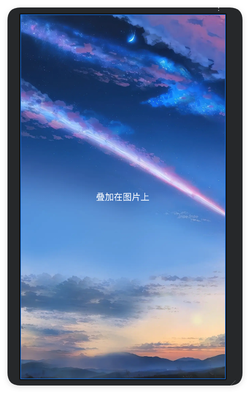
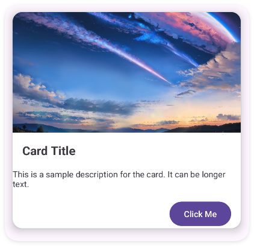

# 安卓界面布局解析

1. **LinearLayout**（线性布局）  
2. **RelativeLayout**（相对布局）  
3. **ConstraintLayout**（约束布局）  
4. **FrameLayout**（帧布局）  
5. **TableLayout**（表格布局）  
6. **GridLayout**（网格布局）  
7. **ScrollView**（垂直滚动布局）  
8. **HorizontalScrollView**（水平滚动布局）  
9. **CardView**（卡片布局）  
10. **ViewPager/ViewPager2**（分页滑动布局）  
11. **CoordinatorLayout**（协调布局）  
12. **RecyclerView**（列表/网格/瀑布流布局）  
13. **AppBarLayout**（应用栏布局）  
14. **FlexboxLayout**（弹性布局）  
15. **NavigationView**（导航抽屉布局，Material Design 扩展）  
16. **MotionLayout**（动画驱动布局，ConstraintLayout 子类）

## 一、基础布局容器

### 1. 线性布局（LinearLayout）
最简单最常用的布局。子视图线性排列（水平/垂直）
```xml
    <LinearLayout
        android:layout_width="wrap_content"
        android:layout_height="wrap_content"
        android:orientation="horizontal">
        <Button
            android:layout_width="wrap_content"
            android:layout_height="wrap_content"
            android:text="点我！" />
        <Button
            android:layout_width="wrap_content"
            android:layout_height="wrap_content"
            android:text="点我！" />
    </LinearLayout>

</LinearLayout>
```

1. `android:orientation="horizontal | vertical"`  
   - `horizontal`：子视图**水平**排列（从左到右）  
   - `vertical`：子视图**垂直**排列（从上到下）

2. `android:layout_width="match_parent | wrap_content | 具体数值"`  
   - `match_parent`：宽度填满父容器  
   - `wrap_content`：宽度包裹内容大小  
   - `具体数值`：如 `100dp`，指定固定宽度  

3. `android:layout_height="match_parent | wrap_content | 具体数值"`  
   - 含义与 `layout_width` 相同，控制高度

4. `android:layout_weight="0 | 正数"`  
   - `0`：不分配剩余空间（默认）  
   - 正数（如 `1`, `2`, `0.5`）：按比例分配剩余空间

5. `android:gravity="top | bottom | left | right | center | center_horizontal | center_vertical"`  
   - 控制**所有子控件**在布局内的对齐方式  
   - 可组合使用，如：`center_horizontal|bottom`

6. `android:layout_gravity="top | bottom | left | right | center | center_horizontal | center_vertical"`  
   - 控制**单个子控件**在父布局中的对齐方式

7. `android:baselineAligned="true | false"`  
   - `true`：默认，子控件基线对齐  
   - `false`：不对齐，提升性能

8. `android:baselineAlignedChildIndex="整数"`  
   - 设置第几个子控件为基线对齐参考，例如：`1` 表示第二个子控件

9. `android:divider="@drawable/xxx"`  
   - 设置子控件之间的分隔线图片或形状

10. `android:showDividers="none | beginning | middle | end"`  
    - `none`：不显示  
    - `beginning`：最前显示  
    - `middle`：子控件之间显示  
    - `end`：最后一个后显示  
    - 可组合使用，如：`beginning|middle`

11. `android:measureWithLargestChild="true | false"`  
    - `true`：所有子控件按最大子控件的尺寸测量  
    - `false`：默认，各自按需测量

**适用场景**：  按钮组、简单表单、等分布局（如底部导航栏图标）


### 2. 相对布局（RelativeLayout）
**特点**：
- 通过相对定位实现复杂布局
- 支持属性如`layout_toRightOf`、`layout_centerInParent`
- 相对布局虽然灵活，但过度嵌套可能会导致布局复杂且难以维护。因此，在设计布局时，应尽量简化结构，避免不必要的嵌套。

**适用场景**：  
视图间存在复杂相对位置关系的界面（如聊天消息气泡）

```
<RelativeLayout
    xmlns:android="http://schemas.android.com/apk/res/android"
    android:layout_width="match_parent"
    android:layout_height="match_parent"
    android:padding="16dp">

    <TextView
        android:id="@+id/title"
        android:layout_width="wrap_content"
        android:layout_height="wrap_content"
        android:text="标题" />

    <Button
        android:layout_width="wrap_content"
        android:layout_height="wrap_content"
        android:layout_below="@id/title"
        android:layout_marginTop="16dp"
        android:text="按钮在标题下面" />
</RelativeLayout>
```
定位属性：
* android:layout_alignParentTop：与父布局顶部对齐
* android:layout_alignParentBottom：与父布局底部对齐
* android:layout_alignParentLeft：与父布局左侧对齐
* android:layout_alignParentRight：与父布局右侧对齐
* android:layout_alignParentStart：与父布局起始边对齐
* android:layout_alignParentEnd：与父布局结束边对齐
* android:layout_alignTop：与另一个视图顶部对齐
* android:layout_alignBottom：与另一个视图底部对齐
* android:layout_alignLeft：与另一个视图左侧对齐
* android:layout_alignRight：与另一个视图右侧对齐
* android:layout_alignStart：与另一个视图起始边对齐
* android:layout_alignEnd：与另一个视图结束边对齐
* android:layout_above：位于另一个视图上方
* android:layout_below：位于另一个视图下方
* android:layout_toLeftOf：位于另一个视图左侧
* android:layout_toRightOf：位于另一个视图右侧
* android:layout_toStartOf：位于另一个视图起始边
* android:layout_toEndOf：位于另一个视图结束边
* android:layout_centerInParent：在父布局中居中
* android:layout_centerHorizontal：在父布局中水平居中
* android:layout_centerVertical：在父布局中垂直居中


### 3. 约束布局（ConstraintLayout）
ConstraintLayout与RelativeLayout有些类似，是一个布局管理器（ViewGroup），但要强大许多，用来解决解决嵌套层级过深的问题和应对复杂布局的设计需求（提供了链（Chains）、屏障（Barriers）、引导线（Guidelines）等高级功能）我们使用的时候一般是为了让布局能够根据屏幕大小调整（按比例伸缩）。
链：在某一个方向上有着相互约束的一组子View就是一个链，可以在头部子View上设置样式改变所有子View之间的约束（均分，比例分配）。
组：避免子View的排列方式会产生相互依赖，会有牵一发动全身的情况出现。现在用Group了
使用场景：
1. 当线性布局使用（as LinearLayout）可以减少嵌套层级，链式布局（Chains）可以很好的实现动态调整间距比例。
2. 当层叠布局使用（as FrameLayout）可换可不换，不用杀鸡用牛刀
3. 当相对布局使用（as RelativeLayout）凡是用到RelativeLayout的地方都应该换成ConstaintLayout。引入基线对齐、角度定位（如圆形约束）和Guideline参照线，支持更精确的布局控制
4. 在性能上，ConstraintLayout不需要两次测量，性能更优秀

推荐文章：https://juejin.cn/post/6949186887609221133

```
<androidx.constraintlayout.widget.ConstraintLayout
    xmlns:android="http://schemas.android.com/apk/res/android"
    xmlns:app="http://schemas.android.com/apk/res-auto"
    android:layout_width="match_parent"
    android:layout_height="match_parent"
    android:padding="16dp">

    <TextView
        android:id="@+id/label"
        android:layout_width="wrap_content"
        android:layout_height="wrap_content"
        android:text="我是中心文本"
        app:layout_constraintTop_toTopOf="parent"
        app:layout_constraintBottom_toBottomOf="parent"
        app:layout_constraintStart_toStartOf="parent"
        app:layout_constraintEnd_toEndOf="parent"/>
</androidx.constraintlayout.widget.ConstraintLayout>
```

## 二、特殊用途布局

### 4. 帧布局（FrameLayout）
**特点**：
- 子视图层叠显示
- 默认以左上角为锚点
- 常用`layout_gravity`调整位置

**适用场景**：  
悬浮按钮、叠加图层（如视频播放器的控制栏）

```
<FrameLayout
    xmlns:android="http://schemas.android.com/apk/res/android"
    android:layout_width="match_parent"
    android:layout_height="match_parent">

    <ImageView
        android:layout_width="match_parent"
        android:layout_height="match_parent"
        android:src="@drawable/bg_sky"
        android:scaleType="centerCrop" />

    <TextView
        android:layout_width="wrap_content"
        android:layout_height="wrap_content"
        android:text="叠加在图片上"
        android:layout_gravity="center"
        android:textColor="#FFFFFF"
        android:textSize="18sp"/>
</FrameLayout>
```

### 5. 卡片布局（CardView）
**特点**：
- 自带圆角阴影效果
- 需依赖`cardview`库
- 可设置`cardElevation`控制立体感

**适用场景**：  
商品卡片、新闻列表项、信息展示模块

示例：


```
<androidx.constraintlayout.widget.ConstraintLayout xmlns:android="http://schemas.android.com/apk/res/android"
    xmlns:app="http://schemas.android.com/apk/res-auto"
    android:layout_width="match_parent"
    android:layout_height="match_parent">

    <androidx.cardview.widget.CardView
        android:id="@+id/cardView"
        android:layout_width="0dp"
        android:layout_height="wrap_content"
        android:layout_margin="16dp"
        app:cardCornerRadius="16dp"
        app:cardElevation="8dp"
        app:layout_constraintTop_toTopOf="parent"
        app:layout_constraintStart_toStartOf="parent"
        app:layout_constraintEnd_toEndOf="parent">

        <androidx.constraintlayout.widget.ConstraintLayout
            android:layout_width="match_parent"
            android:layout_height="wrap_content">

            <!-- 图片 -->
            <ImageView
                android:id="@+id/imageView"
                android:layout_width="match_parent"
                android:layout_height="200dp"
                android:scaleType="centerCrop"
                android:src="@drawable/bg_sky"
                app:layout_constraintTop_toTopOf="parent" />

            <!-- 标题 -->
            <TextView
                android:id="@+id/titleTextView"
                android:layout_width="wrap_content"
                android:layout_height="wrap_content"
                android:layout_margin="16dp"
                android:text="Card Title"
                android:textSize="20sp"
                android:textStyle="bold"
                app:layout_constraintTop_toBottomOf="@id/imageView"
                app:layout_constraintStart_toStartOf="parent" />

            <!-- 描述 -->
            <TextView
                android:id="@+id/descriptionTextView"
                android:layout_width="wrap_content"
                android:layout_height="wrap_content"
                android:layout_margin="16dp"
                android:text="This is a sample description for the card. It can be longer text."
                android:textSize="14sp"
                app:layout_constraintTop_toBottomOf="@id/titleTextView"
                app:layout_constraintStart_toStartOf="parent"
                app:layout_constraintEnd_toEndOf="parent" />

            <!-- 按钮 -->
            <Button
                android:id="@+id/button"
                android:layout_width="wrap_content"
                android:layout_height="wrap_content"
                android:layout_margin="16dp"
                android:text="Click Me"
                app:layout_constraintTop_toBottomOf="@id/descriptionTextView"
                app:layout_constraintEnd_toEndOf="parent" />

        </androidx.constraintlayout.widget.ConstraintLayout>
    </androidx.cardview.widget.CardView>
</androidx.constraintlayout.widget.ConstraintLayout>
```

### 6. 协调布局（CoordinatorLayout）
**特点**：
- 支持子视图联动行为
- 需配合`Behavior`类实现复杂交互
- 常与`AppBarLayout`组合使用

**适用场景**：  
可折叠工具栏、视差滚动效果（如豆瓣电影详情页）

推荐阅读：https://segmentfault.com/a/1190000020472057


## 三、数据驱动布局

### 7. 列表布局（RecyclerView）
**特点**：
- 支持千万级数据高效渲染
- 通过`LayoutManager`控制排列方式（线性/网格/瀑布流）
- 需自定义`Adapter`和`ViewHolder`

**适用场景**：  
社交动态流、电商商品列表、聊天记录

### 8. 分页布局（ViewPager2）
**特点**：
- 支持水平/垂直滑动分页
- 基于`RecyclerView`重构
- 与`TabLayout`联动实现标签导航

**适用场景**：  
图片轮播、教程引导页、分类信息切换（如知乎顶部导航）


## 四、表格与网格布局

### 9. 传统表格（TableLayout）
**特点**：
- 通过`TableRow`定义行
- 自动平均分配列宽
- 支持`layout_span`合并单元格

**适用场景**：  
数据报表、设置选项分组（如WIFI网络列表）

### 10. 网格布局（GridLayout）
**特点**：
- 精确控制行列分布
- 支持动态添加子视图
- 替代方案：`RecyclerView+GridLayoutManager`

**适用场景**：  
九宫格菜单、日历视图、图标矩阵


## 五、滚动与响应布局

### 11. 垂直滚动（ScrollView）
**特点**：
- 仅支持单方向滚动
- 必须包含一个直接子容器
- 嵌套`RecyclerView`需禁用滑动冲突

**适用场景**：  
长表单、文章阅读页、配置页面

### 12. 水平滚动（HorizontalScrollView）
**特点**：
- 实现横向内容滑动
- 典型组合：`LinearLayout`+横向排列

**适用场景**：  
横向标签栏、时间轴、画廊预览


## 六、Material Design 增强布局

### 13. 应用栏布局（AppBarLayout）[➦参考文档](https://blog.csdn.net/weixin_43636084/article/details/123804793)
**特点**：
- 实现工具栏折叠效果
- 必须作为`CoordinatorLayout`子元素
- 配合`CollapsingToolbarLayout`使用

**适用场景**：  
可折叠标题栏（如支付宝个人中心）、视差滚动头部

### 14. 弹性布局（FlexboxLayout）
**特点**：
- 类似CSS Flex布局
- 支持自动换行/间距调整
- 需引入`flexbox`库

**适用场景**：  
动态标签流、瀑布流图片墙、自适应排列元素

 
