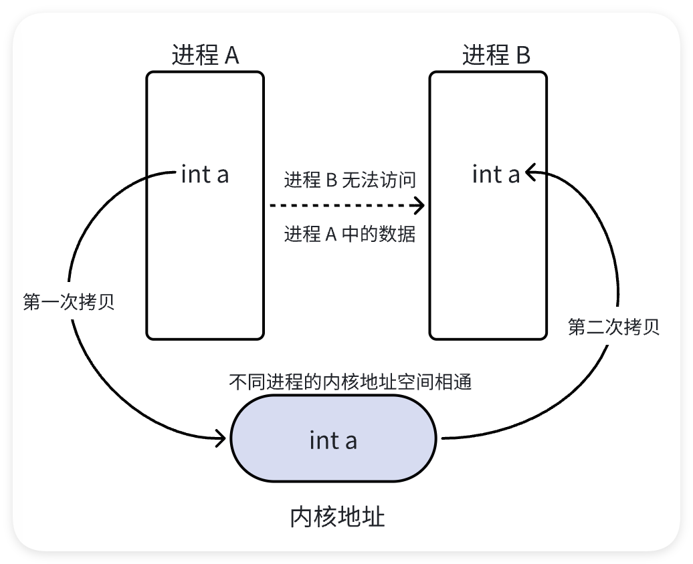
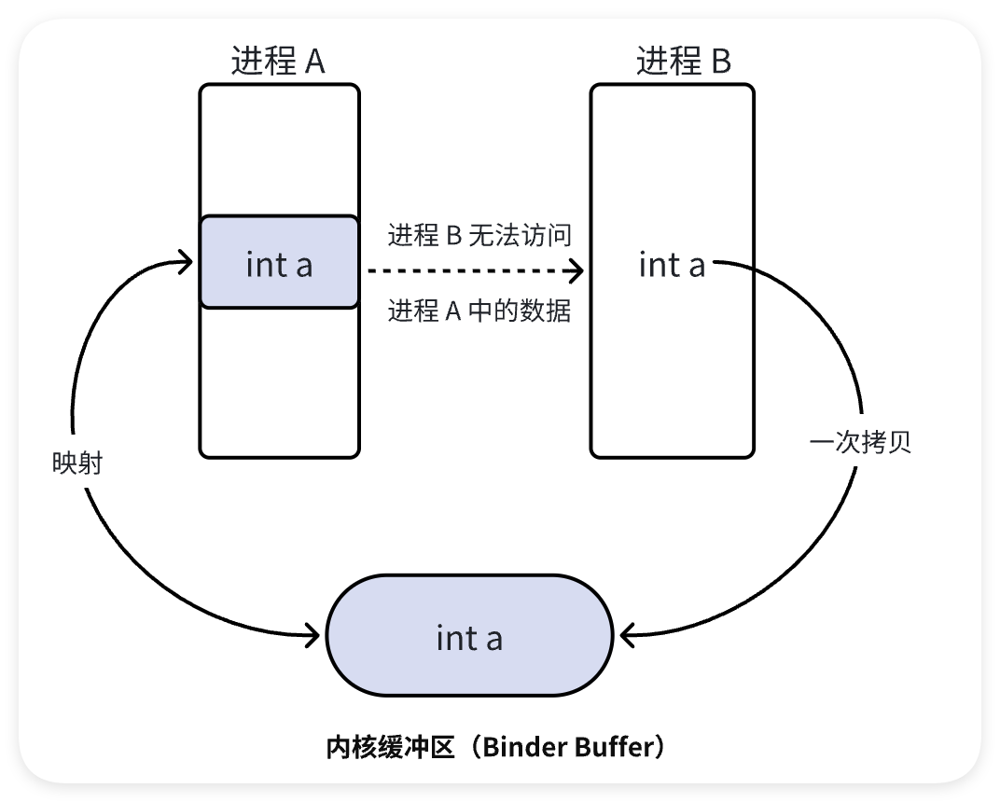

# 进程通信机制 —— Binder

## 基本概念

### 组成
1. **Binder 机制**采用服务端/客户端结构，主要包括以下四个部分：
   - **服务端**
   - **客户端**
   - **ServiceManager**
   - **Binder 驱动**

2. **用户空间与内核空间**：
   - 服务端、客户端和 ServiceManager 均运行在 **用户空间**，彼此之间无法直接交互。
   - **Binder 驱动**位于 **内核空间**，是整个通信机制的核心。

### 内存映射（mmap）
Binder 通过 **内存映射（mmap）** 技术实现高效的进程间通信。其核心原理是多个进程将其虚拟内存区域映射到同一个共享对象，通过对共享对象的操作实现数据同步：

1. **数据流向**：
   - 进程 A 和进程 B 的虚拟内存区域都映射到内核空间中的共享对象。
   - 当进程 A 修改映射区域时，内核同步修改对应的共享对象，进程 B 通过映射关系感知数据变化。

2. **通信过程**：
   - Binder 驱动在 **内核空间**创建一个数据接收缓冲区。
   - 内核空间开辟 **内核缓冲区**，并建立：
     - 内核缓冲区 ↔ 内核数据接收缓冲区的映射关系。
     - 内核数据接收缓冲区 ↔ 接收进程用户空间地址的映射关系。
   - **发送方进程**调用 `copy_from_user()` 将数据拷贝至内核缓冲区。
   - 因为内核缓冲区和接收方用户空间存在内存映射，这相当于数据被直接传递到接收进程用户空间。

### 一次拷贝
- **Binder 优势：**
  - Binder 实现了一次数据拷贝（**发送方用户空间 → 内核缓冲区 ↔ 接收方用户空间**），比传统的两次拷贝效率更高。
  - 传统方式（如消息队列和 Socket）需要两次拷贝：
    1. **发送方用户空间 → 内核空间**
    2. **内核空间 → 接收方用户空间**

- **数据路径：**
  1. 数据由发送方进程拷贝到内核缓冲区。
  2. 通过内存映射，接收进程直接访问该内核缓冲区，实现数据同步。

### 两次拷贝的通信方式
#### 数据流向
1. **发送方进程**：数据从用户空间拷贝到内核空间的缓冲区。
2. **内核空间**：数据从内核缓冲区拷贝到接收方用户空间。

#### 图解

- 数据需要两次拷贝才能完成通信，性能较低。

### 一次拷贝的通信方式
#### 数据流向
1. 数据从发送方用户空间拷贝到内核缓冲区。
2. **通过内存映射**，接收方用户空间直接访问内核缓冲区，无需第二次拷贝。

#### 图解

- 内核缓冲区与用户空间通过内存映射共享物理内存区域，避免了重复拷贝，性能更优。

## Binder 驱动

Binder驱动的源码分析可以参考：
https://juejin.cn/post/7062654742329032740
https://juejin.cn/post/7069675794028560391

Android系统是基于Linux内核的，因此它所依赖的Binder驱动也是一个标准的Linux驱动。具体而言，Binder Driver会将自己注册成一个misc device，并向上层提供一个/dev/binder节点——值得一提的是，Binder节点并不对应真实的硬件设备。Binder驱动运行于内核态，可以提供open()，ioctl()，mmap()等常用的文件操作。

### 提供的接口
代码目录：`common/drivers/android/binder.c`

~~~c
const struct file_operations binder_fops = {
        .owner = THIS_MODULE,
        .poll = binder_poll,
        .unlocked_ioctl = binder_ioctl,
        .compat_ioctl = binder_ioctl,
        .mmap = binder_mmap,
        .open = binder_open,
        .flush = binder_flush,
        .release = binder_release,
};
~~~
由代码可见，Binder驱动总共为上层应用提供了6个接口——其中使用最多的就是binder_ioctl，binder_mmap和binder_open。

