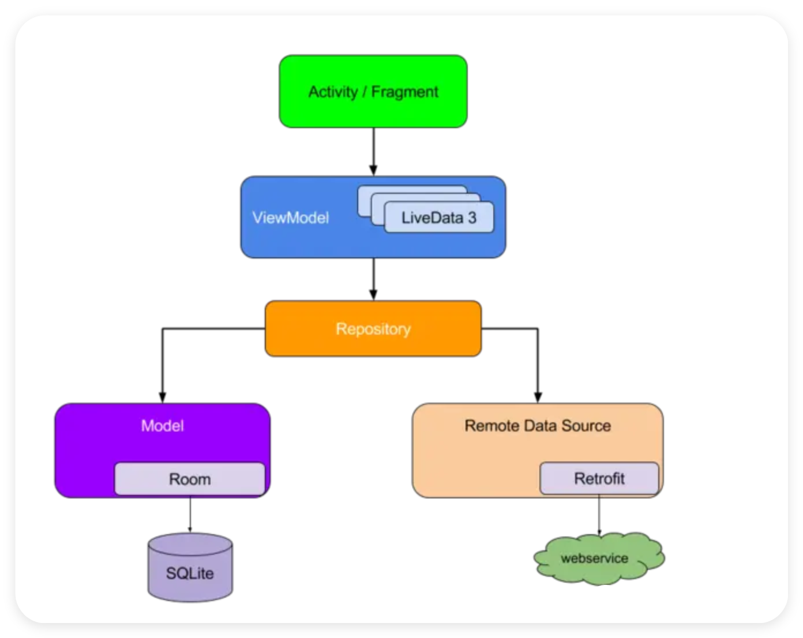

# Databinding 和 ViewBinding

* ViewBinding 当在模块中启用 ViewBinding 后，AGP 会为该模块中的每个 XML 布局文件生成一个绑定类。这些绑定类的实例包含直接引用布局中带有资源 id 的控件的字段，从而避免了在代码中频繁使用 findViewById 来查找视图。

* DataBinding 在编译时会为每个布局文件生成一个绑定类，该类负责连接数据对象与视图，从而实现数据的自动更新和视图与数据的同步。开发者只需提供数据模型，并在布局文件中定义绑定表达式，DataBinding 会在运行时自动处理数据的传递和视图的更新。

* MVVM（Model-View-ViewModel）​​ 是一种架构模式，将应用分为三层：
    * ​​Model​​：数据层，负责业务逻辑和数据存取（如数据库、网络请求）。
    * ​​View​​：UI 层，仅负责展示数据和用户交互（XML 布局 + Activity/Fragment）。
    * ​​ViewModel​​：中间层，将 Model 数据转换为 View 可直接使用的形式，并处理 UI 逻辑。


* Model：对应图中的 Repository（网络请求数据、本地数据库数据等）。
* View：对应图中的 Activity/Fragment 。
* ViewModel：对应图中的 ViewModel 和 LiveData。

我们现在暂且不提数据部分的Repository如何实现，先实现大致的框架。

## ViewBinding 的介绍和使用

### **基本介绍**
当在模块中启用 ViewBinding 后，每个 XML 布局文件生成一个绑定类。这些绑定类的实例包含直接引用布局中带有资源 id 的控件的字段，从而避免了在代码中频繁使用 findViewById 来查找视图。

ViewBinding 原理解析点这里: 
* [推荐阅读 - Jetpack | ViewBinding 详解](https://juejin.cn/post/7005504217935052837) 
* [推荐阅读 - ViewBinding 的本质](https://juejin.cn/post/6844904106268557326)

**安卓的视图绑定的阶段**：
1. 对照XML手写findViewById
2. 使用网站等工具自动生成findViewById
3. AndroidStudio 插件自动生成
4. View注入框架 → [ButterKnife(黄油刀)](https://github.com/JakeWharton/butterknife)
5.  kotlin-android-extensions(KAE)，直接拿id当控件用
6. ViewBinding

### **基本用法**

① 启用ViewBinding：在 app 模块的 build.gradle 文件中，于 android 闭包下添加 android.buildFeatures.viewBinding = true
```
    buildFeatures {
        viewBinding = true
    }
```
② xml 文件自动生成绑定类
绑定类的命名规则：XML文件名转换为Pascal大小写，并加上Binding，比如：`activity_splash.xml → ActivitySplashBinding`。

③ 将 Activity 与视图绑定
```kotlin
class MainActivity : AppCompatActivity() {
    private lateinit var binding: ActivityMainBinding

    override fun onCreate(savedInstanceState: Bundle?) {
        super.onCreate(savedInstanceState)
        // 1、实例化绑定实例
        binding = ActivityMainBinding.inflate(layoutInflater)
        // 2、获得对根视图的引用
        val view = binding.root
        // 3、让根视图称为屏幕上的活动视图
        setContentView(view)
        // 4、引用视图控件
        binding.tvContent.text = "修改TextView文本"
    }
}
```
Activity 的视图绑定很简单，只需要调用相关 Binding 类的 inflate 方法传入一个layoutInflater 参数即可

④ 将 Fragment 与视图绑定
```kotlin
class ContentFragment: Fragment() {
    private var _binding: FragmentContentBinding? = null
    private val binding get() = _binding!!

    override fun onCreateView(
        inflater: LayoutInflater,
        container: ViewGroup?,
        savedInstanceState: Bundle?
    ): View {
        _binding = FragmentContentBinding.inflate(inflater, container, false)
        return binding.root
    }

    override fun onViewCreated(view: View, savedInstanceState: Bundle?) {
        super.onViewCreated(view, savedInstanceState)
        binding.ivLogo.visibility = View.GONE
    }

    override fun onDestroyView() {
        super.onDestroyView()
        // Fragment的存活时间比View长，务必在此方法中清除对绑定类实例的所有引用
        // 否则会引发内存泄露
        _binding = null
    }
}
```

⑤ 将 Dialog 与视图绑定

如果是继承DialogFragment写法同Fragment，如果是继承Dialog写法示例如下(PopupWindow类似)
```kotlin
class TestDialog(context: Context) : Dialog(context) {
    override fun onCreate(savedInstanceState: Bundle?) {
        super.onCreate(savedInstanceState)
        val binding = DialogTestBinding.inflate(layoutInflater)
        setContentView(binding.root)
        binding.tvTitle.text = "对话框标题"
    }
}
```

⑥ 将RecyclerView 与视图绑定

```kotlin
class ContentAdapter(val viewModel: ContentViewModel) :
    BaseQuickAdapter<Content, ContentAdapter.ViewHolder>() {
    
    override fun onBindViewHolder(holder: ViewHolder, position: Int, data: Content?) {
        holder.bindData(data!!)
    }

    override fun onCreateViewHolder(context: Context,parent: ViewGroup,viewType: Int): ViewHolder {
        // 在这里对视图进行绑定
        return ViewHolder(ItemContentBinding.inflate(LayoutInflater.from(context), parent, false))
    }

    inner class ViewHolder(val binding: ItemContentBinding) :
        RecyclerView.ViewHolder(binding.root) { ... }
```

⑦ 将自定义ViewGroup 与视图绑定
```kotlin
class TestLayout: LinearLayout {
    constructor(context: Context): super(context)
    constructor(context: Context, attrs: AttributeSet): super(context, attrs) {
        val inflater = LayoutInflater.from(this.context)
        val binding = ItemLayoutBinding.inflate(inflater, this, true)
        binding.tvLayout.text = "自定义ViewGroup"
    }

    override fun onDraw(canvas: Canvas?) {
        super.onDraw(canvas)
    }
}
```
注意：ViewGroup子类才能使用视图绑定，View子类不可使用

### **ViewBinding 的封装**

我们可以通过封装简化下面的代码：

::: code-group
```kotlin [简化前] {4-5}
    override fun onCreate(savedInstanceState: Bundle?) {
        super.onCreate(savedInstanceState)

        var binding = ActivitySplashBinding.inflate(LayoutInflater.from(this))
        setContentView(binding.root)
    }
```

```kotlin [使用 kotlin 高阶函数简化] {2}
// 使用只需要这一行
private val binding by binding(ActivitySplashBinding::inflate)

//下面这段建议放到AppCompatActivityExt.kt 这样的单独的文件中
fun <VB: ViewBinding> AppCompatActivity.binding(
    bindingInflater: (LayoutInflater) -> VB
): Lazy<VB> {
    return lazy(LazyThreadSafetyMode.NONE) {
        bindingInflater.invoke(layoutInflater).apply {
            setContentView(this.root)
        }
    }
}
```
:::

其他还有使用反射的方式等，我这里不做补充。另外也可以使用开源 API库：
* [Binding](https://github.com/hi-dhl/Binding/blob/main/doc/README_CN.md)
* [VBHelper](https://github.com/jaydroid1024/anyby)
这两个开源库的使用都非常简单方便，VBHelper 还对委托属性和 Binding 的详细机制做了详细的讲解。

**ViewBinding** 和 **DataBinding** 的区别：
可以把ViewBinding看做DataBinding功能的子集，它有的功能DataBinding都有，不需要数据绑定，单纯想替代findViewById 可以用ViewBinding。

## DataBinding 的介绍和使用

### 基本介绍

DataBinding用于实现数据与 UI 的绑定，它支持单向绑定和双向绑定。
* 单向绑定：数据源到 UI 的单向流动，即数据的变化会自动反映到 UI 上，但 UI 上的修改不会影响数据源。
* 双向绑定：数据和 UI 之间的双向同步，即数据的变化会自动更新 UI，UI 上的修改也会自动更新数据。

### 使用方式

① 开启数据绑定：在 app 模块的 build.gradle 文件中，于 android 闭包下添加
```kotlin
    buildFeatures {
        dataBinding true
    }
```

② 使用 DataBinding，下面对比只使用ViewBinding和使用DataBinding的情形
SplashActivity.kt
::: code-group
```kotlin [ViewBinding] {3,9}
class SplashActivity : AppCompatActivity() {

    private val binding by binding(ActivitySplashBinding::inflate)

    private var mCount: Int = 0
    override fun onCreate(savedInstanceState: Bundle?) {
        super.onCreate(savedInstanceState)
        binding.btTest.setOnClickListener {
            binding.tvTest.text = "计数器：${++mCount}"
        }
    }
}
```

```kotlin [DataBinding 单向绑定] {8}
class SplashActivity : AppCompatActivity() {

    private val binding by binding(ActivitySplashBinding::inflate)

    override fun onCreate(savedInstanceState: Bundle?) {
        super.onCreate(savedInstanceState)
        binding.btTest.setOnClickListener {
            ++binding.mCount
        }
    }
}
```
:::
AppCompatActivityExt.kt
```kotlin
fun <VB: ViewBinding> AppCompatActivity.binding(
    bindingInflater: (LayoutInflater) -> VB
): Lazy<VB> {
    return lazy(LazyThreadSafetyMode.NONE) {
        bindingInflater.invoke(layoutInflater).apply {
            setContentView(this.root)
        }
    }
}
```
activity_splash.xml
::: code-group
```xml [ViewBinding]
<LinearLayout xmlns:android="http://schemas.android.com/apk/res/android"
    android:layout_width="match_parent"
    android:layout_height="match_parent"
    android:orientation="vertical">

    <TextView
        android:id="@+id/tv_test"
        android:layout_width="match_parent"
        android:layout_height="48dp"
        android:gravity="center"
        android:text="计数器：0" />

    <Button
        android:id="@+id/bt_test"
        android:layout_width="100dp"
        android:layout_height="wrap_content"
        android:layout_gravity="center_horizontal"
        android:text="加1" />

</LinearLayout>
```

```xml [DataBinding 单向绑定] {2-8,30}
<?xml version="1.0" encoding="utf-8"?>
<layout xmlns:android="http://schemas.android.com/apk/res/android">

    <data>
        <variable
            name="mCount"
            type="int" />
    </data>

    <LinearLayout
        android:layout_width="match_parent"
        android:layout_height="match_parent"
        android:orientation="vertical">

        <TextView
            android:id="@+id/tv_test"
            android:layout_width="match_parent"
            android:layout_height="48dp"
            android:gravity="center"
            android:text="@{`计数器` + mCount }" />

        <Button
            android:id="@+id/bt_test"
            android:layout_width="100dp"
            android:layout_height="wrap_content"
            android:layout_gravity="center_horizontal"
            android:text="加1" />

    </LinearLayout>
</layout>
```
:::

③ 详细说明

推荐阅读：[【Jetpack】学穿：DataBinding → 数据绑定 (使用篇)](https://juejin.cn/post/7088602915128442917)
