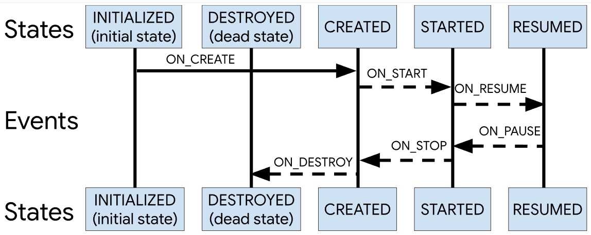

## Lifecycle

Android Lifecycle 是 Jetpack 组件中非常重要的一环，通过它可以实现对宿主（Activity、Fragment、Service 等）生命周期的监控和管理，从而提升代码的健壮性与资源管理效率。本文将详细介绍 Lifecycle 的基本概念、使用方式、以及它在 Fragment 和 Activity 中的具体实现原理，并附带代码示例，帮助大家更好地理解和应用这一机制。

### 1. Lifecycle 基础概念

在 Android 开发中，组件（如 Activity、Fragment、Service）都有自己的生命周期。Lifecycle 组件通过定义一系列状态和事件（如 `INITIALIZED`、`CREATED`、`STARTED`、`RESUMED`、`DESTROYED` 以及 `ON_CREATE`、`ON_START`、`ON_RESUME` 等）来描述这些变化。开发者可以通过注册观察者（`LifecycleObserver`）来监听并响应这些生命周期事件。



更多细节可以参考官方文档：[官方文档](https://developer.android.google.cn/topic/libraries/architecture/lifecycle?hl=zh-cn)。

### 2. 如何使用 Lifecycle 观察宿主状态

#### 2.1 注册 LifecycleObserver

在默认情况下，Activity 和 Fragment 已经实现了 `LifecycleOwner` 接口，我们可以直接调用 `lifecycle` 获取 Lifecycle 实例。要监听生命周期变化，只需让自己的类实现 `LifecycleObserver` 接口（更推荐使用 `DefaultLifecycleObserver`），然后在宿主组件中注册该观察者即可。

以下代码示例展示了如何实现并注册一个自定义的生命周期观察者：

```kotlin
class MyObserver : DefaultLifecycleObserver {
    override fun onStart(owner: LifecycleOwner) {
        Log.d("MyObserver", "Activity onStart")
    }

    override fun onStop(owner: LifecycleOwner) {
        Log.d("MyObserver", "Activity onStop")
    }
}
```

在 Activity 中注册观察者：

```kotlin
class MainActivity : AppCompatActivity() {
    override fun onCreate(savedInstanceState: Bundle?) {
        super.onCreate(savedInstanceState)
        lifecycle.addObserver(MyObserver()) // 添加生命周期观察者
    }
}
```

#### 2.2 LifecycleScope 与协程

Lifecycle 提供了 `lifecycleScope` 用于在合适的生命周期范围内执行协程任务，从而避免内存泄漏。例如：

```kotlin
lifecycleScope.launch {
    delay(2000)
    Log.d("LifecycleScope", "This will be cancelled if Lifecycle is destroyed")
}
```

当宿主组件进入 `onDestroy` 状态时，绑定到该生命周期的协程将自动取消，确保资源不会泄露。

#### 2.3 在特定生命周期执行任务

使用 `repeatOnLifecycle` 方法可以确保任务仅在特定的生命周期状态下执行，如在 `STARTED` 状态下：

```kotlin
lifecycleScope.launch {
    lifecycle.repeatOnLifecycle(Lifecycle.State.STARTED) {
        Log.d("LifecycleScope", "This runs when the lifecycle is at least STARTED")
    }
}
```

这种方式非常适用于监听 LiveData 或 Flow 数据流，确保任务在 Activity 或 Fragment 不可见时不会继续执行。

#### 2.4 Lifecycle 在 Service 中的应用

在 Service 中使用 Lifecycle 需要借助 `LifecycleService`。例如：

```kotlin
class MyService : LifecycleService() {
    init {
        lifecycle.addObserver(MyObserver())
    }
}
```

这样 `MyObserver` 就可以感知 Service 的生命周期变化了。

### 3. Fragment 中的 Lifecycle 实现

Fragment 默认实现了 `LifecycleOwner` 接口，其内部通过 `LifecycleRegistry` 来管理生命周期事件的分发。以下是相关概念及实现细节：

#### 3.1 LifecycleOwner、Lifecycle 与 LifecycleRegistry

- **LifecycleOwner**：表示拥有生命周期的组件，如 Activity 和 Fragment。
- **Lifecycle**：抽象类，用于管理生命周期事件和观察者，并存储当前的生命周期状态。
- **LifecycleRegistry**：Lifecycle 的具体实现类，Fragment 内部维护了一个 `LifecycleRegistry` 实例，用于分发生命周期事件。

Fragment 中的生命周期管理示例：

```kotlin
open class Fragment : ComponentCallbacks, OnCreateContextMenuListener, LifecycleOwner {
    // 每个 Fragment 都有一个 LifecycleRegistry 实例
    private val mLifecycleRegistry = LifecycleRegistry(this)

    override fun getLifecycle(): Lifecycle {
        return mLifecycleRegistry
    }
    
    override fun onCreate(savedInstanceState: Bundle?) {
        super.onCreate(savedInstanceState)
        // 分发 ON_CREATE 事件给观察者
        mLifecycleRegistry.handleLifecycleEvent(Lifecycle.Event.ON_CREATE)
    }
    
    override fun onResume() {
        super.onResume()
        // 分发 ON_RESUME 事件给观察者
        mLifecycleRegistry.handleLifecycleEvent(Lifecycle.Event.ON_RESUME)
    }
    
    override fun onDestroy() {
        super.onDestroy()
        // 分发 ON_DESTROY 事件给观察者
        mLifecycleRegistry.handleLifecycleEvent(Lifecycle.Event.ON_DESTROY)
    }
}
```

#### 3.2 Fragment 自定义 LifecycleOwner

有时在 Fragment 内部的某个组件（如 Camera 或 MediaPlayer）需要单独管理生命周期，可以自定义 `LifecycleOwner`。示例如下：

1. 自定义 LifecycleOwner 类：

```kotlin
class CustomLifecycleOwner : LifecycleOwner {
    private val lifecycleRegistry = LifecycleRegistry(this)

    override fun getLifecycle(): Lifecycle {
        return lifecycleRegistry
    }
    
    fun setState(state: Lifecycle.State) {
        lifecycleRegistry.currentState = state
    }
}
```

2. 在 Fragment 中使用：

```kotlin
class MyFragment : Fragment() {
    private val customLifecycleOwner = CustomLifecycleOwner()

    override fun onCreate(savedInstanceState: Bundle?) {
        super.onCreate(savedInstanceState)
        customLifecycleOwner.setState(Lifecycle.State.CREATED)
    }
    
    override fun onResume() {
        super.onResume()
        customLifecycleOwner.setState(Lifecycle.State.RESUMED)
    }
    
    override fun onDestroy() {
        super.onDestroy()
        customLifecycleOwner.setState(Lifecycle.State.DESTROYED)
    }
}
```

### 4. Activity 中的 Lifecycle 实现

Activity 的生命周期管理主要由 `ComponentActivity` 及其子类（如 `FragmentActivity` 和 `AppCompatActivity`）实现。下面介绍其实现原理。

#### 4.1 继承结构

Activity 的继承结构如下：

- AppCompatActivity → FragmentActivity → ComponentActivity → android.app.Activity

其中，FragmentActivity 内部持有一个 `LifecycleRegistry` 实例，用于管理并分发生命周期事件。

#### 4.2 FragmentActivity 中的 Lifecycle 实现

在 FragmentActivity 中，通过重写生命周期方法，将生命周期事件分发给 `LifecycleRegistry`。示例如下：

```java
public class FragmentActivity extends ComponentActivity {
    final LifecycleRegistry mFragmentLifecycleRegistry = new LifecycleRegistry(this);

    public Lifecycle getLifecycle() {
        return mFragmentLifecycleRegistry;
    }
    
    @Override
    protected void onCreate(@Nullable Bundle savedInstanceState) {
        super.onCreate(savedInstanceState);
        mFragmentLifecycleRegistry.handleLifecycleEvent(Event.ON_CREATE);
    }
    
    @Override
    protected void onStart() {
        super.onStart();
        mFragmentLifecycleRegistry.handleLifecycleEvent(Event.ON_START);
    }
    
    @Override
    protected void onResumeFragments() {
        mFragmentLifecycleRegistry.handleLifecycleEvent(Event.ON_RESUME);
        mFragments.dispatchResume();
    }
    
    @Override
    protected void onPause() {
        super.onPause();
        mFragmentLifecycleRegistry.handleLifecycleEvent(Event.ON_PAUSE);
    }
    
    @Override
    protected void onStop() {
        super.onStop();
        mFragmentLifecycleRegistry.handleLifecycleEvent(Event.ON_STOP);
    }
    
    @Override
    protected void onDestroy() {
        super.onDestroy();
        mFragmentLifecycleRegistry.handleLifecycleEvent(Event.ON_DESTROY);
    }
}
```

在以前的实现中，还使用了 ReportFragment 来辅助管理生命周期事件的分发，但现在主要通过 LifecycleRegistry 来实现。

### 5. LifecycleRegistry 的实现原理

LifecycleRegistry 作为 Lifecycle 的具体实现类，其核心逻辑主要体现在以下两个方法上：

#### 5.1 addObserver 方法

- **封装观察者**：将传入的 `LifecycleObserver` 封装为 `ObserverWithState` 对象，通过内部适配器统一转换为 `LifecycleEventObserver`，并最终通过 `onStateChanged()` 回调。
- **状态初始化**：根据当前宿主状态，为观察者设置初始状态（如果宿主处于 `DESTROYED` 状态，则观察者直接初始化为 `DESTROYED`；否则为 `INITIALIZED`）。
- **同步状态**：使用 while 循环逐步推进观察者状态，使其依次接收到 `CREATED`、`STARTED`、`RESUMED` 等事件，从而实现完整的生命周期通知。

#### 5.2 handleLifecycleEvent 方法

- **计算新状态**：通过 `getStateAfter(event)` 方法根据生命周期事件计算出新的状态。例如，`ON_STOP` 事件对应 `CREATED` 状态。
- **更新宿主状态**：调用 `moveToState(newState)` 方法更新 LifecycleRegistry 内部的当前状态。
- **同步观察者状态**：再次通过 while 循环遍历所有注册的观察者，并依次调用 `ObserverWithState.dispatchEvent()` 方法，确保观察者状态逐级更新，从而收到所有中间状态的变化。

---
>推荐阅读：https://juejin.cn/post/7120472134853328909


