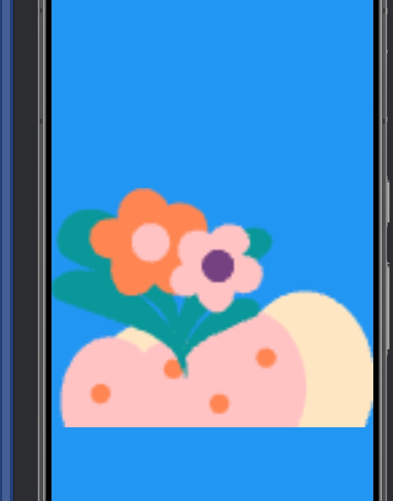

# ViewPager

## 基础概念

ViewPager 允许用户通过左右滑动来浏览一系列的页面或视图，常用于实现引导页、图片轮播、多页标签等内容展示。
1. ViewPager类直接继承了ViewGroup类，所有它是一个容器类，可以在其中添加其他的view类。
2. ViewPager类需要一个PagerAdapter适配器类给它提供数据。
3. ViewPager经常和Fragment一起使用，并且提供了专门的FragmentStateAdapter类供Fragment中的ViewPager使用。
4. 现在ViewPager的适配器有PagerAdapter 和 FragmentStateAdapter，其他几种已经过时。如果页面由普通的视图组成（不是 Fragment），并且页面数量较少，选择 PagerAdapter。

## 示例 - 引导页轮播图

1. 创建具体需要显示的Fragment
```xml
<FrameLayout xmlns:android="http://schemas.android.com/apk/res/android"
    xmlns:tools="http://schemas.android.com/tools"
    android:layout_width="match_parent"
    android:layout_height="match_parent"
    tools:context=".component.guid.GuideFragment">

    <ImageView
        android:id="@+id/icon"
        android:layout_width="match_parent"
        android:layout_height="match_parent"
        android:layout_gravity="center_horizontal">
    
    </ImageView>

</FrameLayout>
```
我们简单的只放一个 ImageView ，然后在 Fragment 实例化的时候将图片的数据传入

```kotlin
class GuideFragment : Fragment() {

    private var _binding: FragmentGuideBinding? = null
    private val binding get() = _binding!!

    override fun onCreate(savedInstanceState: Bundle?) {
        super.onCreate(savedInstanceState)
        LogUtils.d("GuideFragment onCreate")
    }

    override fun onCreateView(
        inflater: LayoutInflater,
        container: ViewGroup?,
        savedInstanceState: Bundle?
    ): View? {
        _binding = FragmentGuideBinding.inflate(inflater, container, false)

        // 这里获取传递的图片数据并绑定到视图
        val data = requireArguments().getInt("img")
        binding.icon.setImageResource(data)

        return binding.root
    }

    override fun onDestroyView() {
        super.onDestroyView()
        _binding = null
    }

// 这里是希望使用newInstance 实例化的时候传入图片数据
    companion object {
        fun newInstance(data: Int): GuideFragment {
            val args = Bundle()
            args.putInt("img", data)

            val fragment = GuideFragment()
            fragment.arguments = args
            return fragment
        }
    }
}
```

2. 创建GuideActivity
```xml
<LinearLayout xmlns:android="http://schemas.android.com/apk/res/android"
    xmlns:app="http://schemas.android.com/apk/res-auto"
    xmlns:tools="http://schemas.android.com/tools"
    android:id="@+id/main"
    android:layout_width="match_parent"
    android:layout_height="match_parent"
    android:orientation="vertical"
    tools:context=".component.guid.GuideActivity">

    <androidx.viewpager2.widget.ViewPager2
        android:id="@+id/viewPager"
        android:layout_width="match_parent"
        android:layout_height="0dp"
        android:layout_weight="1" />

</LinearLayout>
```
布局文件中简单放一个 ViewPager 即可，没有什么别的说法
```kotlin
class GuideActivity : AppCompatActivity() {
    private lateinit var adapter: GuideAdapter

    override fun onCreate(savedInstanceState: Bundle?) {
        super.onCreate(savedInstanceState)

        setContentView(R.layout.activity_guide)

        val viewPager = findViewById<ViewPager2>(R.id.viewPager)

        // 1.初始化 pageImages
        val pageImages = listOf(
            R.drawable.bg_lvzhi,
            R.drawable.bg_danche,
            R.drawable.bg_huacao,
            R.drawable.bg_caocong,
            R.drawable.bg_songshu
        )

        // 2. 创建适配器并传入数据源
        adapter = GuideAdapter(
            supportFragmentManager, // 使用 supportFragmentManager
            lifecycle,
            pageImages
        )

        // 3. 绑定适配器和 ViewPager
        viewPager.adapter = adapter
    }
}
```
这里我们把图片资源整合成一个列表，传给 Adapter，并且将 Adapter 和 ViewPager 绑定。

3. 创建 Adapter
```kotlin
class GuideAdapter(
    fragmentManager: FragmentManager,
    lifecycle: Lifecycle,
    private val pageImages: List<Int>
) : FragmentStateAdapter(fragmentManager, lifecycle) {
    override fun createFragment(position: Int): Fragment {
        return GuideFragment.newInstance(pageImages[position])
    }

    override fun getItemCount(): Int {
        return pageImages.size
    }
}
```
这一步很关键也很简单，只需要返回我们需要的 Fragment ，也就是GuideFragment

这样就完成了，可以看到如下效果：

可以左右滑动显示不同的图片

4. 指示器的创建，如果我们想要图片下面有个指示器指示这是第几个 Fragment，可以使用一些网上的开源库，当然，不少开源库比较老了，需要搭配 ViewPager 使用而不是 ViewPager2
